# QuantLab

**Local-first quant research terminal for backtesting, portfolio analytics, strategy building, and report generation.**

QuantLab is a full-stack quantitative research platform you run on your own machine. A **FastAPI** backend computes every backtest, optimization, and risk metric on **real historical price data** — yfinance daily OHLCV, or your own **CSV uploads** — with no lookahead bias. A **Next.js** frontend gives you an interactive "neon terminal" dashboard to explore strategies, compare them, build your own with no code, run portfolio analytics, and export branded research reports. Saved backtests, strategies, and reports persist in a **local SQLite** database — no account, no cloud sync, no telemetry.

> **Research only.** QuantLab is an educational/research tool. It does **not** place trades, connect to a broker, or provide investment advice. See [Limitations & Disclaimers](#limitations--disclaimers).

📦 **Showcase candidate: v4.7.0** — [changelog](CHANGELOG.md) · foundational [v4.0.0 release notes](docs/RELEASE_NOTES_v4.0.0.md)

---

## Features at a glance

| Area | Capabilities |
|---|---|
| **Strategy Research** | Single-asset backtesting · SMA / RSI / Bollinger / Momentum / Volatility Breakout / Pairs · long / short / long-short modes · strategy comparison with shared simulation settings · parameter sweep · train/test validation · walk-forward validation |
| **Backtest Studio engines** | Transaction cost model · position sizing (no leverage) · risk-management exits · annualization convention (252/365/auto) · benchmark analytics + charts (alpha/beta/TE/IR, equity/drawdown/excess overlays) |
| **Trust Layer** | Data-quality diagnostics · reproducible SHA-256 config hash · Robustness Lab (block-bootstrap Monte Carlo) · Stability Lab (parameter-sensitivity heatmap) · honest caveats in every report |
| **Content Engine** | Strategy Library (live model pages) · Paper Replication Series (classic papers + inspired demos) · Quant Disasters Series (risk-education case studies) |
| **Options & Volatility Lab** | European Black–Scholes pricing + Greeks · implied-volatility solver (bisection, no-arb bounds) · single & multi-leg expiration payoff diagrams · 10 strategy presets · **CRR binomial tree** with European/American exercise, early-exercise diagnostic & Black–Scholes convergence · **Monte Carlo** GBM engine (European / Asian / barrier · seed-reproducible · standard error + 95% CI · path preview) · **IV surface** from a manual/sample chain with smile · skew · ATM term structure · **SVI** research fit + heatmap · **Heston** stochastic-volatility Monte Carlo (variance mean reversion · leverage effect · Feller diagnostic · path previews) · **unified scenario presets** · button-driven **cross-model comparison** · deterministic dark-theme chart palette — educational, no live chains, not calibrated |
| **Event-Driven / Arbitrage Lab** | Event study — benchmark-adjusted **abnormal returns** (market-adjusted / mean-adjusted / market-model) · cumulative abnormal return (CAR) · multi-event **CAAR** · event-window charts · simplified **merger-arbitrage** calculator (spread · expected/annualized return · breakeven probability) — research diagnostic, sample/manual events, no live filings |
| **Yield Curve Lab** | Zero rates · discount factors (annual / semiannual / continuous) · implied forward rates (not forecasts) · linear interpolation · curve **shocks** (parallel / steepener / flattener / butterfly) · fixed-rate **bond pricing** (YTM or curve discounting) · Macaulay / modified **duration** · **DV01 magnitude** · **convexity** · **Short Rate Models** — **Vasicek** / **CIR** Monte Carlo simulation (mean reversion, path preview, terminal distribution) + analytic **zero-coupon pricing** and **Feller** diagnostic — synthetic/manual curves, no live rates feed, no market calibration, no Hull-White |
| **FX Lab** | Spot/forward via **covered interest rate parity** · **FX carry** decomposition (interest differential + expected spot move) · **PPP deviation** (relative PPP) · **currency exposure** translation + symmetric stress · **Garman-Kohlhagen** FX option pricing (price · d1/d2 · delta · gamma · vega · theta · domestic/foreign rho) — domestic-per-foreign convention, no live FX rates, no FX vol surface, not investment advice |
| **Credit Risk Lab** | **Merton** structural model (equity as a call on assets · **distance to default** · risk-neutral default probability · credit spread) · reduced-form **hazard / survival** curve · simplified **CDS par-spread** approximation (`λ·(1−R)` + protection/premium legs) · reduced-form **risky bond** pricing (survival-weighted flows + recovery, vs risk-free; whole-period schedules only) — no live CDS/bond data, no full CVA, not investment advice |
| **Portfolio Risk Lab** | **Portfolio analytics** on a deterministic 8-asset static sample: expected return · volatility · **Sharpe** · **covariance / correlation** matrices · **marginal / component / percent risk contributions** · **historical VaR & CVaR** (monthly, loss-positive) · **stress-scenario P&L** · deterministic **efficient frontier** · **minimum-variance** & **risk-parity** portfolios · **factor exposure** (9 illustrative factors · per-asset beta heatmap · portfolio β = Bᵀw) · **factor risk decomposition** (factor + specific/idiosyncratic, variance-share) · **deterministic scenario stress** (equity selloff · rates shock · USD squeeze · commodity rally · credit stress → asset/factor impact + worst/best asset) · **constrained optimization** (long-only box-capped candidate search → max-Sharpe · min-variance · target-return · target-volatility · friendly infeasible message) · **Black-Litterman** (implied equilibrium returns · illustrative sample views · posterior returns · BL-optimized portfolio) · **hypothetical rebalance / turnover** (current vs optimized weights · Δ · ½Σ\|Δ\|) · **Monte Carlo** (fixed-seed parametric-Gaussian wealth paths · fan chart · terminal-wealth distribution · probability of loss · drawdown-breach probability · simulated VaR/CVaR) · **bootstrap robustness** (resampled sample-series paths) · **assumption sensitivity** (±return/vol/correlation/rate shifts → return/vol/Sharpe/VaR/CVaR) · **optimization robustness** (base vs worst-case Sharpe · range · rank stability) · editable weights · copyable formula reference — long-only v1, static sample data, illustrative betas/views (not estimated, not forecasts), candidate-search optimizer (not production), fixed-seed simulations (not forecasts), no trade orders, not investment advice |
| **Cross-Sectional Scanner** | A **second engine** (portfolio-level): ranks a synthetic universe every rebalance date · **dollar-neutral** long/short baskets (gross 1.0 → +0.5 / −0.5) · cross-sectional **reversal** & **momentum** signals · **lookahead-safe** (weights at *t* earn the *t→t+1* return) · turnover-based costs · equity / drawdown / exposure / turnover charts + latest ranking — synthetic universe, no live market data, not investment advice |
| **AFML Methodology Lab** | Leakage-aware financial-ML **labeling + validation + sampling** toolkit: symmetric **CUSUM** event sampling · **triple-barrier** labeling (profit-take / stop-loss / vertical → +1 / −1 / 0) · sample **concurrency** · sample **uniqueness weights** · **purged K-fold + embargo CV** with leakage diagnostics · **sequential bootstrap** (uniqueness-aware sampling vs random) · **fractional differentiation** (fixed-width preprocessing + memory and heuristic stability diagnostics) — synthetic demo data, methodology only (not a trained model), CPCV / meta-labeling planned, not investment advice |
| **Global Markets Globe** (v1.1) | "Mission-control" **3D globe** — hand-built **canvas 2D** orthographic projection (dot-matrix landmass · atmosphere halo · starfield · 30° graticule · great-circle capital-flow arcs · drag-to-rotate · auto-rotate · reset · **no WebGL/Three.js dependency**, graceful canvas-unavailable fallback) · three-zone responsive layout (left rail · center globe · right dossier · bottom region tape) · **15 sample markets** · region-colored pulsing markers + hover tooltips · region filter, search & quick-jump · keyboard-accessible market list · per-country **dossier** (Market Pulse · Macro Vitals · FX & Rates · Market Structure · Sample Headlines + sentiment pills · QuantLab cross-links · bias pill · "Last updated: Static sample") · **typed backend data layer** (`GET /globe/markets` · `/globe/markets/{id}` · `/globe/regions`) with a **graceful frontend fallback** to the bundled dataset · **optional, opt-in adapters** (disabled by default, **fail closed** to static data): a **FRED macro** adapter (US-only v1, no key needed) and a **delayed index/FX quote** adapter (curated markets, reuses free yfinance, **delayed never real-time**) with honest per-section `source_status` (`static_sample`/`fred_live`/`fred_unavailable`/`delayed_quote`/`quote_unavailable`/`news_unavailable`); plus a **news-sentiment scaffold** (static sample headlines + Bullish/Bearish/Neutral tags — **no live news**, no scraping, no API) · **shareable dossier permalinks** (`/?view=globe&market=<id>` or `/globe?market=<id>` · deep-select on load · marker click updates the URL · browser back/forward · **Share-link** button · palette + dashboard deep-links · unknown id falls back to the default market with a friendly notice) · **guided tours & presentation mode** (four educational curated walks — `/globe?tour=global|asia|macro|risk` · Previous/Next/Exit + Copy-link + progress dots · screenshot-friendly `/globe?presentation=1` that keeps source badges & static-data notice · **Copy dossier summary** plain-text button · unknown tour shows a friendly notice — educational only, not signals/recommendations) — **static illustrative sample data by default**, not real-time quotes, not investment advice (see [docs/GLOBE_DATA.md](docs/GLOBE_DATA.md)) |
| **Custom Strategy Lab** | No-code rule builder (whitelisted indicators, **no `eval`**) · saved templates · JSON import / export · built-in template gallery |
| **Portfolio Lab** | Equal-weight backtesting · optimization (min-vol / max-Sharpe) · walk-forward optimization · efficient frontier · risk dashboard · stress testing · factor analysis |
| **Reporting** | Markdown export · PDF / print export · four branded report templates · saved reports gallery |
| **Product Experience** | Command Center home · guided demo mode · Ctrl/Cmd + K command palette · global search · app settings · neon theme & charts · toast notifications · loading / empty / offline states |

Each capability is described in detail under [Features](#features) below.

---

## Screenshots

A tour of the running app — every chart and metric below is a **real backend run** on real historical data (no mock data). Full capture parameters are in [`docs/screenshots/README.md`](docs/screenshots/README.md).

> The captures below predate the Trust Layer + Content Engine + Options Lab phases. Screenshots of the **Simulation Settings, benchmark visualization, Robustness Lab, Stability heatmap, Strategy Library, Paper Replications, Quant Disasters, and Options Lab** will be added after the next showcase capture pass — the exact checklist is in [`docs/SCREENSHOT_PLAN.md`](docs/SCREENSHOT_PLAN.md). Nothing shown or listed is mocked.

### Command Center

**Command Center** — the local-first research hub: hero CTAs into the four core workflows (run research, learn strategies, study papers, study failures), quick actions, guided demos, a quick-start checklist, recent saved work, live system status, a **Trust Layer** explainer grid, **Content Engine** cards (Strategy Library · Paper Replications · Quant Disasters, with live registry counts), registry-driven **Featured** items, and an honest **Platform Direction** panel (Built / Planned / Future). Static sections render even with the backend offline.

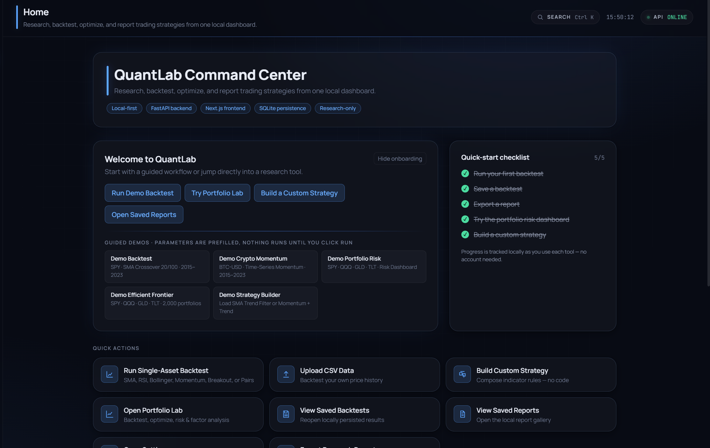

### Strategy Research

**Single-asset backtest** — a neon equity curve (strategy vs. dashed buy-&-hold benchmark) and a semantic-red drawdown chart, computed with a one-day signal shift so there is no lookahead bias.

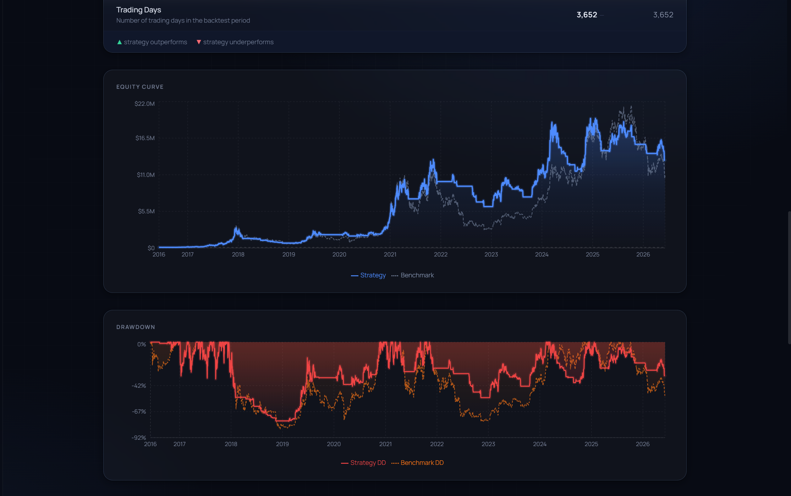

**Strategy comparison** — the built-in single-asset strategies run on one ticker and date range, then compared and ranked side by side.

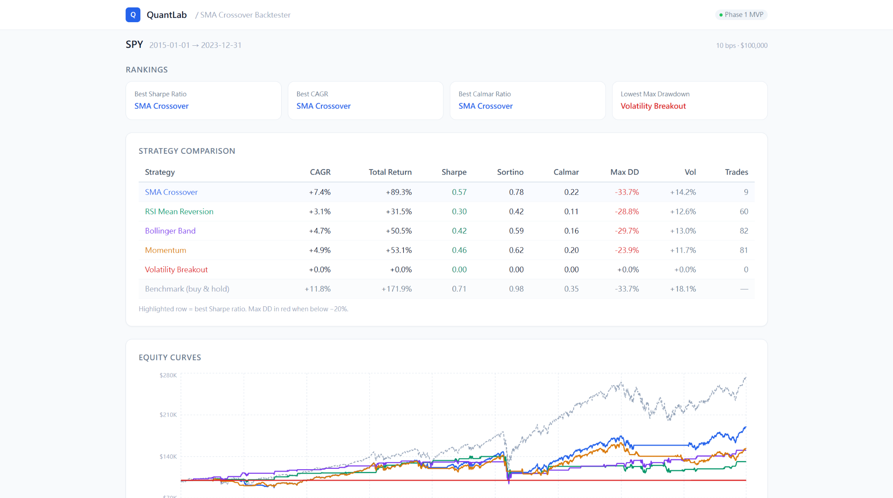

### Custom Strategy Lab

**No-code strategy builder** — compose entry/exit rules from whitelisted indicators (SMA, RSI, Bollinger, momentum) with ALL/ANY logic and backtest them — no code, no `eval`.

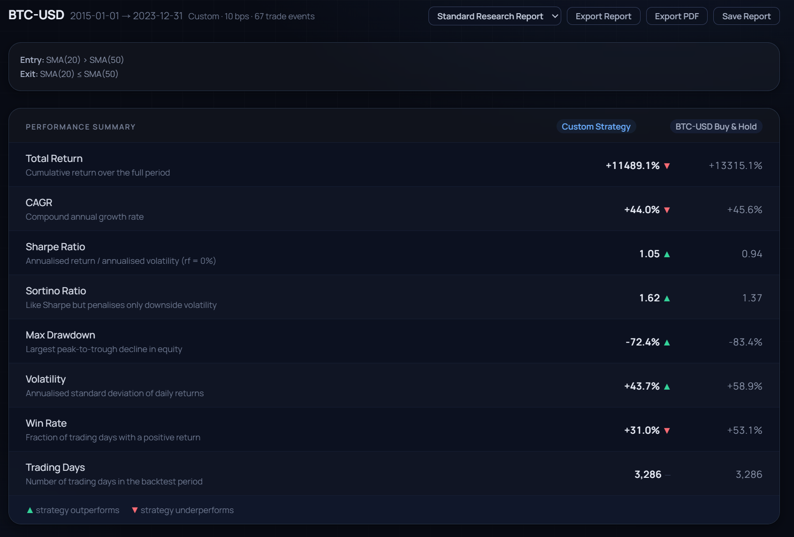

### Portfolio Lab

**Efficient frontier** — thousands of random long-only portfolios coloured by Sharpe, with the minimum-volatility, maximum-Sharpe, and equal-weight portfolios highlighted alongside their weights.

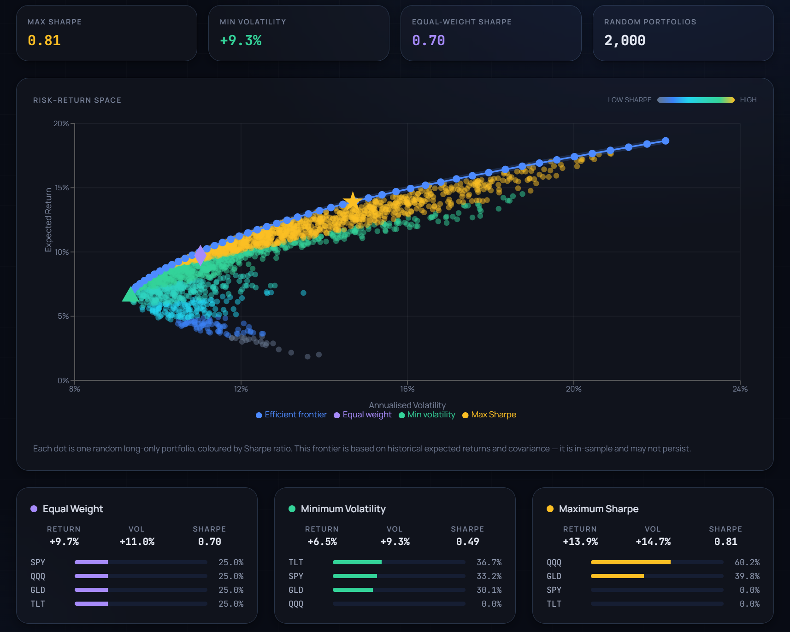

**Risk dashboard** — per-asset return/volatility, a correlation heatmap, diversification ratio, and each asset's contribution to total portfolio risk.

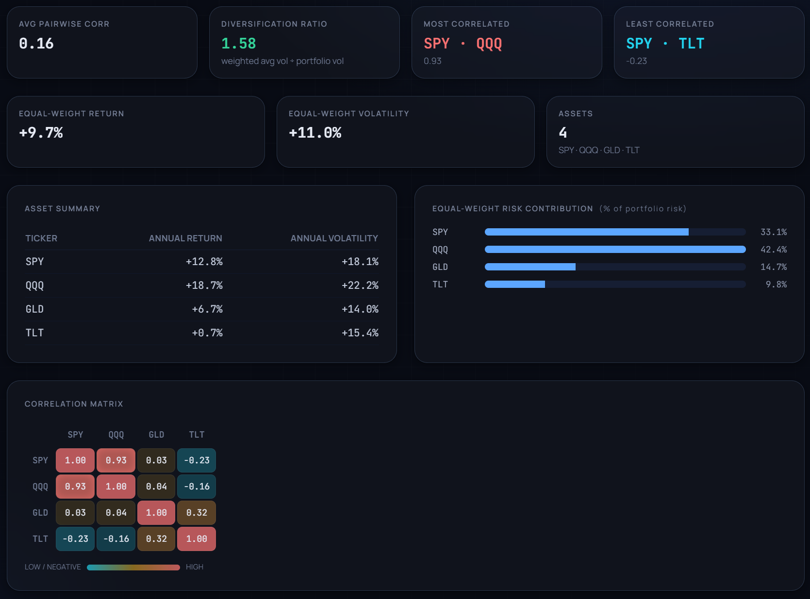

**Stress test** — how a static portfolio would have moved through historical stress windows (e.g. the COVID crash) versus its benchmark.

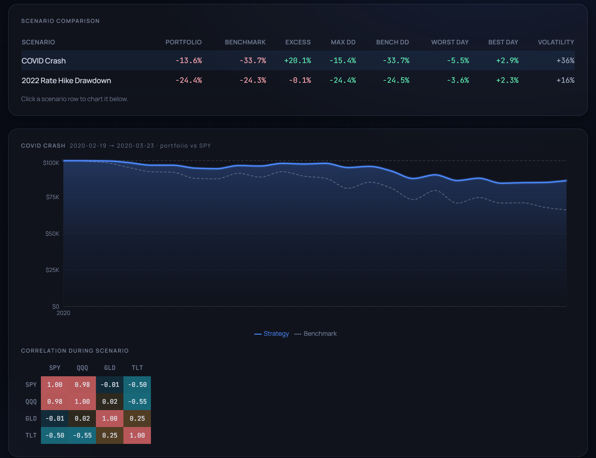

**Factor analysis** — an OLS regression of portfolio returns onto ETF factor proxies, reporting betas, alpha, R², and an actual-vs-fitted curve.

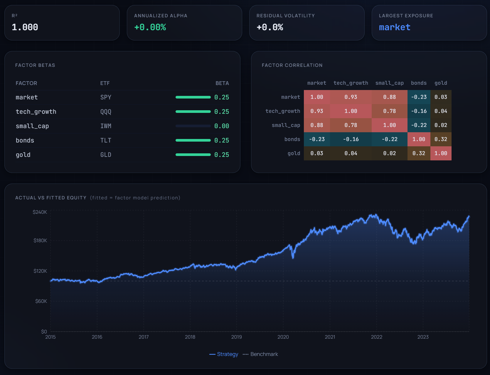

### Reporting

**Saved reports gallery** — research reports saved locally as Markdown in SQLite, ready to reopen, download, or print to PDF.

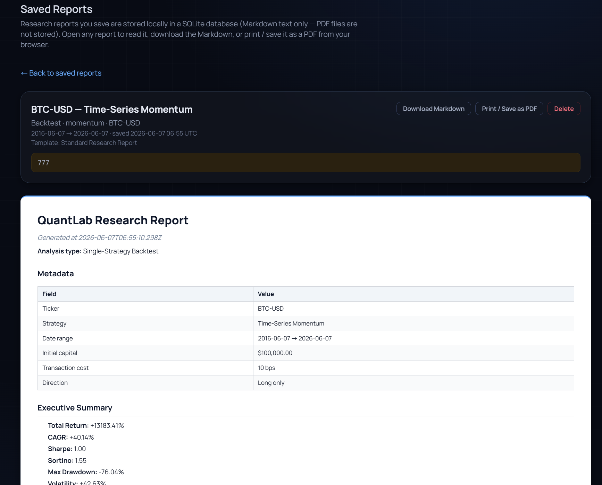

### Productivity & Settings

**Command palette + global search** — `Ctrl/Cmd + K` opens a fast palette that searches navigation, guided demos, and your real saved backtests, reports, and templates.

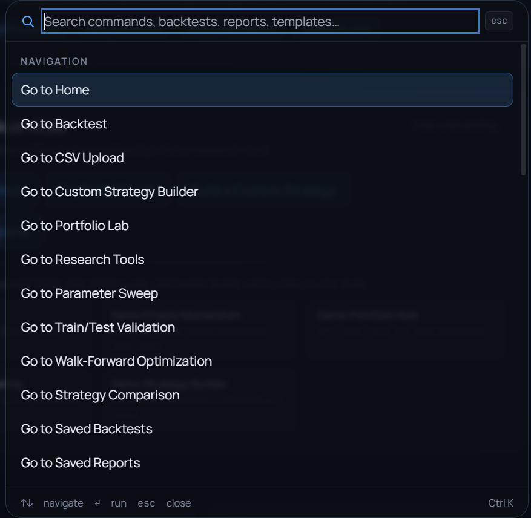

**Settings & neon theme** — local preferences and the CSS-variable accent theme (six accents including a Risk mode), stored in the browser only — no account required.

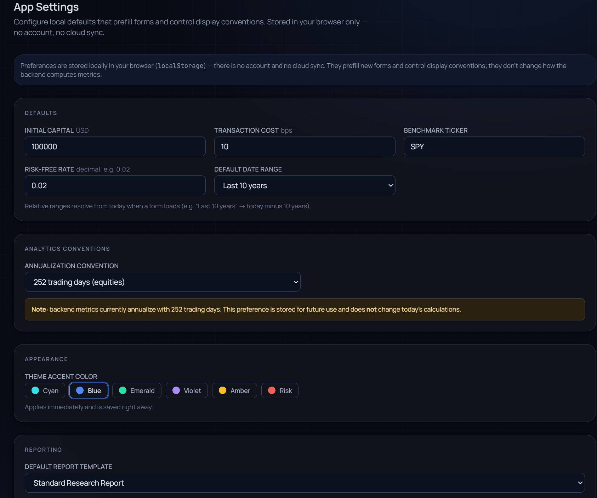

---

## Tech Stack

| Layer | Technology |
|---|---|
| Backend API | FastAPI · Python 3.11 · Pydantic v2 |
| Data | yfinance (daily OHLCV) · user CSV upload |
| Backtest / analytics engine | NumPy · pandas · SciPy (vectorised) |
| Frontend | Next.js 14 (App Router) · React 18 · TypeScript |
| Styling | Tailwind CSS · CSS-variable neon theme |
| Charts | Recharts |
| Local persistence | SQLite (saved backtests, reports & strategy templates) |
| Testing | pytest (1,060+ tests across 53 files, synthetic data) |
| CI | GitHub Actions |
| Containerisation | Docker · Docker Compose |

---

## Features

### Command Center (Home Dashboard)

The app opens on a **Home / Command Center** — a local-first landing dashboard that ties every workspace together. It shows:

- **Quick Actions** that jump straight into running a backtest, uploading CSV data, building a custom strategy, opening the Portfolio Lab, viewing saved backtests/reports, or exporting a research report.
- **Recent Saved Backtests** and **Recent Saved Reports** — the latest few records pulled live from the backend (`GET /saved-backtests`, `GET /saved-reports`), each clickable to open the full record. Empty states are shown when nothing has been saved yet (no placeholder/fake rows).
- **System Status** — real API health (`GET /health`), local-only mode, and live saved-backtest / saved-report counts.
- A **Feature Map** summarising the Strategy Lab, Research Tools, Portfolio Lab, and Reporting areas.

Home is the default view; the sidebar's **Home** item returns to it at any time. The entire dashboard reads from existing endpoints — no new backend, no authentication, no cloud sync.

### Onboarding & Guided Demo Mode

First-time users get a **Welcome to QuantLab** onboarding card on the Command Center with one-click starting points:

- **Primary actions** — *Run Demo Backtest*, *Try Portfolio Lab*, *Build a Custom Strategy*, *Open Saved Reports*.
- **Guided demo presets** — *Demo Backtest* (SPY · SMA 20/100), *Demo Crypto Momentum* (BTC-USD · Time-Series Momentum), *Demo Portfolio Risk* (SPY/QQQ/GLD/TLT risk dashboard), *Demo Efficient Frontier* (SPY/QQQ/GLD/TLT · 2,000 portfolios), and *Demo Strategy Builder* (load the *SMA Trend Filter* or *Momentum + Trend* gallery template).

Clicking a demo **navigates to the right workspace and prefills the form**, then shows a banner — *"Demo parameters loaded. Click Run to execute."* **Nothing runs automatically**: demo results are produced by the same real backend API calls as any manual run, only after you press **Run**. No performance numbers, saved backtests, or reports are ever fabricated — demo presets only fill in inputs.

The card is **dismissible** ("Hide onboarding", remembered in `localStorage`); a small **"Show welcome guide"** link brings it back. A **quick-start checklist** (run your first backtest, save a backtest, export a report, try the portfolio risk dashboard, build a custom strategy) tracks progress via local flags set as you actually use each tool — all browser-local, no account required.

### Command Palette + Global Search (Ctrl/Cmd + K)

Press **Ctrl + K** (Windows/Linux) or **⌘ + K** (macOS) anywhere to open a searchable command palette — or click the **Search** chip in the top bar. Type to filter, navigate with **↑/↓**, run with **Enter**, dismiss with **Esc** (or click outside). It's purely a navigation accelerator that calls the *same* handlers as the sidebar and onboarding — no separate router, no fake data.

It searches **both commands and your real local resources**:

- **Navigation** — Go to Home / Backtest / Options Lab / CSV Upload / Custom Strategy Builder / Portfolio Lab / Research Tools / Parameter Sweep / Train/Test / Walk-Forward / Strategy Comparison / Saved Backtests / Saved Reports / Settings.
- **Guided demos** — Load Demo Backtest, Demo Crypto Momentum, Demo Portfolio Risk, Demo Efficient Frontier, Demo Strategy Builder (reusing the onboarding presets — they prefill, they never auto-run).
- **Content Engine pages** — Strategy Library, Paper Replications, and Quant Disasters entries, including planned/read-only educational pages such as Fama–French and live case studies such as LTCM / Flash Crash. Run/prefill commands are only shown for implemented strategies and inspired demos.
- **Options Lab** — open the Black–Scholes calculator, implied-volatility solver, or payoff builder directly.
- **Portfolio tools** — jump straight to Portfolio Backtest, Optimization, Walk-Forward, Efficient Frontier, Risk Dashboard, Stress Test, or Factor Analysis.
- **Report** — *Export current backtest report (Markdown)*, shown only when a backtest result is on screen (broken/no-op commands are never listed).
- **Saved Backtests** — search by name, ticker, or strategy (shows ticker · strategy · Sharpe/CAGR · date); opens the saved backtest detail.
- **Saved Reports** — search by title, ticker, source, or strategy; opens the saved report detail.
- **Strategy Templates** — your saved *My Templates* **and** the built-in **gallery** templates (matched on name, description, and tags); opens the Custom Strategy Builder with that template loaded.

Saved resources are fetched live from the backend (`/saved-backtests`, `/saved-reports`, `/custom-strategies`, `/custom-strategy-gallery`) each time you open the palette — never fabricated. Try `BTC` (your BTC-USD backtests/reports), `momentum` (Momentum commands/templates/reports), `Fama French` (planned paper/model pages with no run button), `LTCM`, `Flash Crash`, or `risk`. Each list is fetched independently, so one failing endpoint never breaks the others.

**Offline behaviour.** If the FastAPI backend is offline, navigation and demo commands still work; saved resources are **omitted** (never shown stale) and the palette shows a *"Saved resources unavailable while backend is offline"* note. Opening a saved backtest or report while the backend is down shows a friendly **Backend offline** panel (amber info card) — explaining the data is safe in local SQLite, the exact `uvicorn` command to start the backend, and **Retry** / **Go to Command Center** actions — instead of a raw HTTP 500. The frontend API layer classifies errors (`classifyApiError`: offline / server / not-found / validation / unknown) so real errors are still surfaced, just presented better.

### Notifications & Error Handling

A consistent **global toast** system (`lib/toast.ts` + `ToastProvider` / `ToastViewport`) gives unified feedback across the app — neon cards, bottom-right, semantic colors (success green / error red / warning amber / info accent), auto-dismiss with hover-pause, manual close, and optional actions. Toasts confirm the important things: backtest/report **saved**, **deleted**, report **markdown exported** / **print preview opened**, custom strategy template **saved / updated / deleted / imported / exported**, **CSV backtest complete** / invalid CSV, and **demo parameters loaded**. A single **"Backend offline"** toast (with a **Retry** action) is de-duplicated, so a burst of failed requests never spams the stack.

An app-level **error boundary** (`AppErrorBoundary`) wraps the whole UI: if an unexpected frontend error occurs, you get a friendly *"Something went wrong"* recovery panel (with **Reload app** / **Go to Command Center** and a collapsible technical-details section) instead of a blank crash — and your local SQLite data is untouched.

Shared **state primitives** (`components/ui/`: `LoadingSkeleton`, `EmptyState`, `OfflineState`, `ErrorState`) give every async surface the same treatment — **shimmer skeletons** while loading (Saved Backtests/Reports tables, Command Center recents, custom-strategy templates, the strategy gallery), clear **empty states** with a next-step action (e.g. *No saved backtests yet → Run Backtest*), the consistent amber **Backend offline** panel with **Retry**, and a collapsible **error card** — so the UI never just says "Loading…" or dumps a raw error.

### Strategies

| Strategy | Type | Parameters | Direction modes |
|---|---|---|---|
| SMA Crossover | Trend-following | Fast window, slow window | long / short / long-short |
| RSI Mean Reversion | Mean-reversion | RSI window, oversold threshold, exit threshold | long-only |
| Bollinger Band Mean Reversion | Mean-reversion | Window, std multiplier, exit band | long-only |
| Time-Series Momentum | Trend-following | Momentum window, entry/exit thresholds | long / short / long-short |
| Volatility Breakout | Trend-following | Lookback window, breakout multiplier, exit window | long / short / long-short |
| Pairs Trading | Statistical arbitrage | Asset Y, asset X, lookback window, entry/exit z-score | long-short spread |

All strategies apply a **one-day signal shift** — the position derived from day T's close prices is applied on day T+1. This prevents lookahead bias by construction.

**Direction modes.** SMA Crossover, Momentum, and Volatility Breakout accept a `position_mode`: `long_only` (default — bullish → long, else cash), `short_only` (bearish → short, else cash), or `long_short` (bullish → long, bearish → short). There is **no leverage** (|position| ≤ 1) and **no margin model**; a short simply earns `−1 × asset_return`. Transaction cost is charged on turnover `|Δposition|`, so a direct long↔short flip costs twice a single open. The trade log uses **BUY / SELL / SHORT / COVER / FLIP_TO_LONG / FLIP_TO_SHORT**. `long_only` behaviour (and every existing long-only result) is byte-for-byte unchanged, and `long_only` is always the default (including Strategy Comparison).

`long_short` is an **advanced research mode**: on upward-trending assets it often *underperforms* long-only due to whipsaws, higher turnover, and short-selling risk — it is most useful for studying bearish-signal quality, not for chasing returns. Short-enabled runs surface a prominent amber **short-selling warning** (near the mode selector, on the results, and in exported reports) and a **Direction Diagnostics** card (time long/short/cash, long vs short gross contribution, turnover) computed from backend fields, so you can see whether the short legs helped or hurt. **Short-selling costs, borrow fees, margin calls, liquidation, and funding are not modelled**, and exported reports add an explicit short-selling caveat plus the `position_mode` in their metadata.

**Strategy Comparison** has its own direction-mode selector (default long-only). The chosen mode is applied to the strategies that support it (SMA Crossover, Momentum, Volatility Breakout); RSI and Bollinger always run long-only and are tagged accordingly. The comparison header shows the active mode, and short modes display the same short-selling warning. RSI and Bollinger don't show the mode selector on the Backtest tab (a small "Long-only strategy" label is shown instead).

**Default parameters are chosen for usability, not performance.** They are demo-friendly starting points intended to make first runs more informative across common assets and date ranges, but they can still produce zero trades when conditions do not trigger signals. They are **not recommendations** and are not tuned for returns. Each strategy form offers one-click **presets** (including the classic long-term variants, e.g. SMA 50/200, Bollinger 2.0σ, 6-/12-month momentum, and a Volatility-Breakout Responsive/Balanced/Conservative set), and you should validate any parameter choice with the **Parameter Sweep**, **Train/Test**, and **Walk-Forward** research tools before drawing conclusions. The Strategy Comparison runs all five single-asset strategies with these same demo-friendly defaults.

**Most built-in strategies are long-only.** They hold cash when not in a position, so trend/momentum/breakout strategies can legitimately **stay flat during downtrends** — that is expected behaviour, not a bug. The UI surfaces a small, non-error info card when a run produces zero or very few trades (and a "No signal · stayed flat" tag in Strategy Comparison) suggesting a more responsive preset or a parameter sweep. For directional flexibility, SMA Crossover, Momentum, and Volatility Breakout support **short / long-short modes** (see Direction modes above); use **Pairs Trading** for dollar-neutral exposure.

### Research Tools

| Tool | Purpose |
|---|---|
| SMA Parameter Sweep | Grid search over fast/slow window combinations; ranks by Sharpe, CAGR, or Calmar |
| SMA Train/Test Validation | Splits data at a user-defined date; selects parameters in-sample, evaluates out-of-sample; reports degradation and an `oos_collapsed` flag |
| SMA Walk-Forward Optimization | Rolls a training window forward, re-selects parameters each fold, stitches OOS windows into a continuous equity curve |
| Strategy Comparison | Runs all five single-asset strategies on the same ticker/period with default parameters and ranks them |

### Performance Metrics

Total return · CAGR · Sharpe ratio · Sortino ratio · Calmar ratio · Max drawdown · Annualised volatility · Win rate · Trade count

Benchmark: buy-and-hold with no transaction costs.

### CSV Upload Backtesting

The **CSV Backtest** workspace lets you upload your own historical price CSV and run any single-asset strategy on it (Pairs Trading excluded). Column detection is flexible: a date column (`date` / `datetime` / `timestamp`) and a close column (`close` / `adj_close` / `adjusted_close`) are required; optional OHLCV columns are ignored. The uploaded series flows through the same lookahead-bias-free strategy, backtest, and metrics stack as the yfinance endpoints (`POST /backtest/csv`).

### Research Report Export

Most result views have an **Export Report** button that generates a clean **Markdown** research report and downloads it as a `.md` file (e.g. `quantlab-report-SPY-sma_crossover-2015-2023.md`). Reports are generated **locally in the browser** from the result data already on screen — nothing is uploaded or stored on the server.

Each report includes metadata, an executive summary, parameters/weights, a performance-metrics table, an equity-curve summary (start/end/peak equity, final & worst drawdown), a trades/events summary, and a standard risk/caveats disclaimer. Export is available from the **Backtest**, **Saved Backtest detail**, and the Portfolio **Equal-Weight Backtest**, **Static Optimization**, **Risk Dashboard**, **Stress Test**, and **Factor Analysis** views.

Alongside the Markdown download, an **Export PDF** button opens a clean, print-friendly preview of the same report. Click **Print / Save as PDF** to produce a PDF through the browser's own print dialog — there is no server-side PDF rendering and no extra dependency. The print view drops the dark app chrome for a white-background, black-text page with readable tables and sensible page breaks.

> The PDF export is browser-based (print to PDF) and is text/table only — embedded chart images are future work.

#### Branded report templates

A **template selector** next to the export buttons chooses the report layout; the selection applies to Markdown download, PDF/print, and Save Report alike:

- **Standard Research Report** — the full default report (metadata, executive summary, parameters/weights, performance + benchmark metrics, equity summary, trades/events, caveats).
- **Executive Summary** — a short report: title, timestamp, analysis type, tickers, date range, the top 5 metrics, a one-paragraph interpretation, and key caveats (no long trades table).
- **Quant Tear Sheet** — performance-focused: metadata, metric table, strategy-vs-benchmark table, equity + drawdown summaries, trade/event summary, an annualization note, and risk caveats.
- **Risk Report** — risk-focused: volatility, max/worst drawdown, and (where the analysis provides them) stress-scenario metrics, factor exposures, correlation diagnostics, and risk contribution. Sections with no data for the current result type are simply omitted — **never fabricated**.

Templates that a given analysis cannot meaningfully fill are not offered (e.g. the Risk Dashboard and Factor Analysis views omit the Quant Tear Sheet). All four are generated locally in the browser from existing result state.

### Saved Reports (Report Gallery)

Next to the export buttons, a **Save Report** button stores the generated report in the local **SQLite** database (`/saved-reports` CRUD endpoints), consistent with Saved Backtests. Only the **Markdown content** and structured metadata (title, source type, tickers, strategy, date range, notes) are persisted — **PDF binaries are never stored**; PDF remains a browser-print operation you can repeat any time.

The **Saved Reports** workspace lists everything you have saved. Open a report to read it (the Markdown is rendered with a small built-in, HTML-escaping renderer — saved content is treated as untrusted text and **no embedded HTML/script is ever executed**), **Download Markdown**, **Print / Save as PDF**, or **Delete** it. Everything stays on your machine — no authentication, no cloud storage.

### App Settings / Preferences

The **Settings** workspace stores local preferences that prefill forms and control display conventions. Settings are kept in **browser `localStorage`** only — there is **no account and no cloud sync**. The annualization preference is sent to new single-asset Backtest and Strategy Comparison runs; portfolio tools keep their current 252 trading-day convention.

- **Defaults** — initial capital, transaction cost (bps), benchmark ticker, risk-free rate, and a default date range (`last_1y` / `last_3y` / `last_5y` / `last_10y` / `custom`). Relative ranges resolve from today when a form loads.
- **Analytics conventions** — annualization convention (`252 trading days`, `365 crypto`, or `auto`). It affects CAGR / Calmar / Sharpe / Sortino / volatility on new single-asset Backtest and Strategy Comparison runs, but never changes trades, equity curves, total return, or drawdown.
- **Appearance** — theme accent color (cyan / blue / emerald / violet / amber, plus a red **Risk** mode), applied immediately and persisted right away (a tiny pre-paint script avoids a flash on reload).
- **Reporting** — the default branded report template preselected by export panels.

Defaults prefill **newly mounted** forms (single-strategy Backtest, Portfolio Backtest / Optimization / Stress Test, and the report template selector). A form you're already editing won't reset out from under you — changes apply to new forms (or after a reload). **Save settings** persists changes; **Reset to defaults** restores the built-in defaults.

#### Neon terminal theme

QuantLab uses a **CSS-variable accent theme** (a "neon quant terminal" look). One token — `data-accent` on `<html>` — re-skins the **whole product**, not just the sidebar: buttons, focus rings, inputs, strategy tabs, links, badges, selected rows, card border/glow, the top-bar accent rule + neon divider, and the primary chart line (with the benchmark on the harmonized partner hue). Charts read the accent via a small `useAccentColors` hook (a `MutationObserver` re-reads the CSS variables) so they restyle instantly on theme change. **Semantic colors are intentionally fixed** across every accent — success stays green/emerald, warnings amber, danger/drawdown red, positive returns green, and the API status indicator keeps its own green/red — so the six accents never turn the UI into a rainbow or hurt readability.

**Neon charts.** The equity-curve and drawdown charts (shared by every backtest, portfolio, optimization, walk-forward, stress, factor, CSV, builder, and saved view) use a shared neon style: a glowing accent strategy line (a wide low-opacity halo behind a crisp line), a subtle accent→transparent gradient area fill that doesn't hide the gridlines, a muted slate **dashed** benchmark, and a dark-glass tooltip with an accent border + glow (`components/charts/`). Drawdown stays semantically **red** with its own red glow. The efficient-frontier line and the parameter-sweep "best cell" follow the accent; the correlation heatmap renders as neon tiles (red glow on concentrated pairs, cyan on diversifying ones) while staying readable.

### Custom Strategy Builder

The **Strategy Builder** workspace is a no-code rule builder for long-only, single-asset strategies (`POST /backtest/custom`). Compose entry and exit rules that compare two operands — `close`, a numeric constant, or an indicator (`sma`, `rsi`, `bb_upper`/`bb_middle`/`bb_lower`, `momentum`) — with `>`, `>=`, `<`, or `<=`. Rules are combined with ALL (AND) or ANY (OR) logic; the position is shifted one bar forward to avoid lookahead bias. Rules are evaluated entirely with vectorised pandas math — **no `eval`, no user code is ever executed**. Indicators reuse the exact formulas of the built-in strategies. No short selling, leverage, or pairs.

### Saved Strategy Templates

The Strategy Builder can **save reusable strategy definitions** (`/custom-strategies` CRUD endpoints). A template stores the rule definition only — entry/exit rules, combine logic, name, description, and tags — and can be loaded back into the builder and re-run on any ticker, date range, or (future) CSV upload. Templates are validated against the same whitelisted rule schema as the live builder, so **no arbitrary code is ever stored or executed** (no `eval`). Create, list, load, update, and delete templates directly from the Strategy Builder workspace.

**Saved Backtests vs. Saved Strategy Templates** — these are distinct:

| | Saved Backtests | Saved Strategy Templates |
|---|---|---|
| Stores | A completed **result** (metrics, equity curve, trades) frozen at run time | A reusable **strategy definition** (rules + logic + metadata) |
| Tied to a ticker/date range | Yes — captures one specific run | No — re-runnable on any ticker/dates |
| Table | `saved_backtests` | `custom_strategy_templates` |
| Purpose | Review/compare past results | Reuse and iterate on a strategy idea |

#### Import / Export

Templates are portable. **Export** any saved template to a self-describing JSON file (`GET /custom-strategies/{id}/export`, or the per-row **Export** button), and **import** one from a file (`POST /custom-strategies/import`, or the **Import Template** button). Exported files deliberately omit `id`, `created_at`, and `updated_at` so they are safe to share. On import the backend re-validates the document against the **same whitelisted rule schema** as the live builder — wrong `type`, missing `schema_version`, empty name, non-whitelisted indicator/operator, or more than 10 rules per list are rejected with HTTP 422. **Imported templates are validated data, never executed code** (no `eval`).

Example exported JSON:

```json
{
  "schema_version": "1.0",
  "type": "quantlab_custom_strategy_template",
  "name": "SMA + RSI Trend Filter",
  "description": "Long when SMA trend is positive and RSI is not overbought.",
  "entry_logic": "AND",
  "exit_logic": "OR",
  "entry_rules": [
    {
      "left": { "type": "indicator", "name": "sma", "params": { "window": 50 } },
      "operator": ">",
      "right": { "type": "indicator", "name": "sma", "params": { "window": 200 } }
    },
    {
      "left": { "type": "indicator", "name": "rsi", "params": { "window": 14 } },
      "operator": "<",
      "right": { "type": "constant", "value": 70 }
    }
  ],
  "exit_rules": [
    {
      "left": { "type": "indicator", "name": "sma", "params": { "window": 50 } },
      "operator": "<=",
      "right": { "type": "indicator", "name": "sma", "params": { "window": 200 } }
    }
  ],
  "tags": ["trend", "rsi"]
}
```

### Multi-Asset Portfolio Backtesting

The **Portfolio Backtest** workspace runs a simple equal-weight, long-only, fully-invested portfolio across up to 20 assets (`POST /portfolio/backtest`). Every asset targets a 1/N weight. Choose a **rebalance frequency**:

- **none** — buy equal-weight once and let the weights drift (buy & hold)
- **monthly / quarterly / yearly** — reset to equal weight on the first trading day of each new period

Rebalancing isn't free: the cost is **turnover-based** — `turnover = Σ|target_weightᵢ − driftedᵢ|` and `cost = equity × turnover × bps/10000`, deducted on the rebalance day. All assets are aligned to their common trading days (dates where any asset is missing are dropped); the benchmark is SPY buy-and-hold when available (in the basket or fetched separately), otherwise the first ticker as a documented fallback. The response includes metrics, the equity curve vs. benchmark, drawdown, per-day weights, and a rebalance-events log.

> The equal-weight backtest is a transparent baseline. For weight optimization, see below.

### Portfolio Optimization

The Portfolio workspace also includes an **Optimization** tab (`POST /portfolio/optimize`) that solves for **long-only** weights (each `wᵢ ≥ 0`, `Σw = 1` — no shorting, no leverage) under one of three objectives:

- **Equal Weight** — `wᵢ = 1/N` (baseline).
- **Minimum Volatility** — minimise `√(wᵀ Σ w)` (portfolio variance).
- **Maximum Sharpe** — maximise `(wᵀμ − r_f) / √(wᵀ Σ w)`.

Expected returns and the covariance matrix are estimated from daily returns and annualised with 252 trading days; the constrained problem is solved with SciPy's SLSQP. The optimized weights are backtested buy-and-hold over the period and compared against the equal-weight portfolio (metrics, equity curve, drawdown). Portfolio Optimization v1 is a static allocation model: `transaction_cost_bps` is accepted for API/UI consistency but no one-time allocation cost or ongoing turnover cost is deducted.

> ⚠️ **In-sample caveat.** Static optimization optimizes weights on the **same** historical window it then backtests. This is in-sample optimization: it will look good by construction, can badly overfit, and **does not predict future performance**. For an out-of-sample variant, use Walk-Forward Optimization below. **Not investment advice.**

### Walk-Forward Portfolio Optimization

The Portfolio workspace's **Walk-Forward Optimization** tab (`POST /portfolio/walk-forward-optimize`) addresses the in-sample problem with rolling, **out-of-sample** optimization:

1. Estimate expected returns and covariance on a **training window** (`train_window_days`).
2. Optimize long-only weights on that window (equal_weight / min_volatility / max_sharpe).
3. Apply those **fixed** weights to the following **test window** (`test_window_days`) — unseen data.
4. Advance by `step_days` and repeat; stitch all test windows into one out-of-sample equity curve.

**No data leakage:** weights for each window are estimated only from that window's training slice and applied to strictly later dates — the optimizer never sees test data.

**Transaction cost (turnover-based):** at each test-window boundary the portfolio moves from the previous weights to the new ones — `turnover = Σ|new_wᵢ − prev_wᵢ|` (the first window's turnover is `Σ|wᵢ − 0| = 1`, i.e. entry from cash). `cost = turnover × bps/10000` is deducted from equity at the start of that test window. The equal-weight benchmark is treated identically (its target never changes, so it pays only the initial entry).

If `step_days < test_window_days`, test windows overlap; the stitched OOS curve uses each window's non-overlapping step slice (and the final window's remaining test tail) so re-optimization happens at the requested step cadence without duplicate dates. If `step_days > test_window_days`, gaps between test windows are intentionally left out of the stitched OOS curve.

The response includes per-window detail (train/test dates, weights, train Sharpe, out-of-sample `test_metrics`, turnover, cost), the stitched OOS equity vs. an equal-weight benchmark, drawdown, aggregate OOS metrics, and a **weight-stability** summary (average/max turnover, per-asset average/min/max weight).

> ⚠️ Walk-forward results are out-of-sample and far more honest than in-sample optimization, but they still rely on historical return/covariance assumptions and **do not predict future performance**. Not investment advice.

### Efficient Frontier

The Portfolio workspace's **Efficient Frontier** tab (`POST /portfolio/efficient-frontier`) visualises the risk–return space of a multi-asset, **long-only** universe. From annualised expected returns and covariance (252-day) it:

- samples many random long-only portfolios (`w_i ≥ 0`, `Σw = 1`; `num_portfolios`, deterministic seed) and computes each one's expected return, volatility, and Sharpe;
- locates the **equal-weight**, **minimum-volatility**, and **maximum-Sharpe** portfolios; and
- traces the **efficient-frontier curve** (minimise volatility for each target return).

The dashboard renders a Recharts scatter plot — x = volatility, y = expected return, hover for Sharpe and weights — with the three special portfolios highlighted, plus weight cards for each. **Expected return** = `wᵀμ`, **volatility** = `√(wᵀΣw)`, **Sharpe** = `(wᵀμ − r_f)/volatility`.

> ⚠️ This is **historical, in-sample** analysis: expected returns and covariance are estimated from the selected window and may not persist. It is descriptive, **not a forecast or investment advice**.

### Portfolio Risk Dashboard

The Portfolio workspace's **Risk Dashboard** tab (`POST /portfolio/risk-dashboard`) reports asset- and portfolio-level risk diagnostics from historical daily returns (252-day annualisation):

- **Per-asset** annualised return and volatility.
- **Correlation matrix** — `returns.corr()`, rendered as a heatmap (cyan for low/negative, amber→red for high). Correlation measures how assets move together (−1 = opposite, 0 = unrelated, +1 = identical); low correlations are what make diversification work.
- **Covariance matrix** — `returns.cov() × 252` (collapsible).
- **Equal-weight portfolio** return, volatility, and **diversification ratio** = weighted-average asset volatility ÷ portfolio volatility. A ratio above 1 means combining the assets reduced risk below the average of their individual risks; higher is better-diversified.
- **Correlation diagnostics** — average / most-correlated / least-correlated pairs.
- **Risk contribution** — each asset's share of total portfolio risk for the equal-weight portfolio: marginal contribution `Σw/σ_p`, component `wᵢ·marginalᵢ`, percent `componentᵢ/σ_p` (the percentages sum to ~1). This reveals when one volatile/correlated asset dominates portfolio risk even at equal dollar weight.

> ⚠️ All figures are **historical estimates** — correlations, volatilities, and risk contributions may not persist out-of-sample. Not investment advice.

### Portfolio Stress Testing

The Portfolio workspace's **Stress Test** tab (`POST /portfolio/stress-test`) shows how a static long-only portfolio (equal or custom weights) would have moved through specific **historical stress windows**, compared against a benchmark. For each scenario the portfolio and benchmark returns are sliced from the full-period series, rebased to the initial capital, and summarised: total return, max drawdown, annualised volatility, worst/best day, **excess return vs benchmark**, and the **asset correlation matrix during the window** (correlations often spike toward 1 in a crisis, which is when diversification helps least).

Built-in scenario presets (add any, or define custom windows):

| Scenario | Window |
|---|---|
| COVID Crash | 2020-02-19 → 2020-03-23 |
| 2022 Rate-Hike Drawdown | 2022-01-03 → 2022-10-14 |
| 2018 Q4 Selloff | 2018-09-20 → 2018-12-24 |
| 2011 Debt Ceiling / Euro Crisis | 2011-07-22 → 2011-10-03 |
| 2008 Global Financial Crisis | 2007-10-09 → 2009-03-09 (needs enough history) |

v1 uses static weights with **no rebalancing or leverage**. The dashboard shows a scenario-comparison table, a selectable scenario equity curve vs benchmark, a correlation heatmap for the selected scenario, and a full-period summary.

> ⚠️ Scenario results are **historical** — they show past behaviour through these windows and **do not guarantee or predict** how a portfolio will respond to future stress. Not investment advice.

### Factor Exposure / Regression Analysis

The Portfolio workspace's **Factor Analysis** tab (`POST /portfolio/factor-analysis`) estimates a portfolio's exposure to a set of **ETF factor proxies** by ordinary least squares (NumPy least squares — no statsmodels, no external Fama-French data):

```
portfolio_return = alpha + Σ beta_k · factor_return_k + residual
```

- **Beta** — sensitivity to each factor (e.g., a market beta of 0.8 means the portfolio tends to move 0.8% for each 1% market move).
- **Alpha** — the average daily/annualised return *not* explained by the factors (the intercept).
- **R²** — the fraction of the portfolio's return variance explained by the factors (0–1; higher = better explained).
- **Residual volatility** — annualised volatility of the unexplained (idiosyncratic) return.

Default factor preset (**Core ETF Factors**): `market: SPY`, `tech_growth: QQQ`, `small_cap: IWM`, `bonds: TLT`, `gold: GLD` — fully editable, plus custom factors. The dashboard shows R²/alpha/residual-vol/largest-exposure cards, a beta table, a factor correlation heatmap, and the actual-vs-fitted equity curve. A **multicollinearity warning** is raised when the factor design matrix is rank-deficient (e.g. duplicate/overlapping proxies).

> ⚠️ Exposures are **historical** and depend on the proxies chosen and the window; **highly correlated factors can make individual betas unstable**. Not investment advice.

#### Strategy Template Gallery

The Strategy Builder includes a built-in **gallery** of curated, ready-to-use strategy templates (`GET /custom-strategy-gallery`). Open the **Gallery** from the Strategy Builder, browse the cards (each shows name, description, tags, difficulty, category, and a readable rule summary), then **Load** one into the builder to run it on any ticker/date range, or **Save to My Templates** to keep a local copy. Built-in templates are **static, pre-validated rule objects — not executable code** (no `eval`); they pass through the exact same whitelisted `CustomRule` validation as user-built strategies.

Built-in templates:

| Template | Category | Entry → Exit |
|---|---|---|
| SMA Trend Filter | trend | SMA(50) > SMA(200) → SMA(50) < SMA(200) |
| RSI Mean Reversion | mean reversion | RSI(14) < 30 → RSI(14) > 50 |
| Momentum + Trend | momentum | Momentum(126) > 0 **AND** SMA(50) > SMA(200) → Momentum(126) ≤ 0 **OR** SMA(50) < SMA(200) |
| Bollinger Mean Reversion | mean reversion | Close < BB Lower(20, 2.0) → Close > BB Middle(20) |
| Defensive Trend Strategy | trend | Close > SMA(200) → Close < SMA(200) |

### Saved Backtests

Completed backtest results can be saved to a local SQLite database and reopened from the Saved Backtests view. Saved records preserve the run name, notes, strategy parameters, metrics, equity curve, and trade log.

The local database lives at `backend/data/quantlab.db` (both `saved_backtests` and `custom_strategy_templates` tables). The backend creates `backend/data/` automatically when needed, and `backend/data/*.db` is ignored by git so local research artifacts are not committed.

### Engineering

- Vectorised backtest, portfolio, and risk engines (no Python loops over price series)
- Transaction cost model: bps charged on turnover (`|Δposition|` / portfolio rebalancing), with a v1 `cost_model` on single-asset backtests (Backtest form → **Cost model** selector) — **simple BPS** (default, backward-compatible), **commission + slippage (+ optional spread)**, or a **conservative** preset (10 + 10 + 5 = 25 bps/side). The response reports `effective_cost_bps`, `total_transaction_cost`, and `cost_drag_return`. Still a static per-side assumption — no size-dependent market-impact model. *(Available on the single-asset **Backtest** form and **Strategy Comparison** (applied globally to all five strategies); CSV upload and the SMA research tools use the simple `transaction_cost_bps` field.)*
- Position sizing: a v1 `position_sizing` on single-asset backtests (Backtest form → **Position sizing** selector) — **Full Allocation** (`type: "full_allocation"`, default/backward-compatible), **Fixed Fraction**, **Volatility Target** (`lookback_days`, no-lookahead rolling realized vol, capped at `max_exposure` — de-levers only), or **Exposure Cap** (cash reserve). Sizing scales exposure magnitude only — signal timing/direction are unchanged and **no leverage** (`|exposure| ≤ 1`). The response reports `average_exposure` and echoes the resolved sizing. *(Available on the single-asset **Backtest** form and **Strategy Comparison**; pairs, CSV, and the SMA research tools use full allocation.)*
- Risk management: a v1 `risk_management` on single-asset backtests (Backtest form → **Risk management** selector) — **None** (default/backward-compatible), **Stop / Take Profit** (`fixed_stop_take_profit`), **Trailing Stop**, **Max Holding** days, or **Combined**. Rules run *after* the signal+mode produce a desired position and *before* sizing; they **close positions to cash only (never reverse)**, a later new signal can re-enter, and they are **daily-close based & lookahead-free** (decision for bar `t` uses prices through `close[t-1]`). The response echoes the resolved rules + `risk_diagnostics` (stop/take/trailing/max-holding exit counts), and trades carry a `reason` (signal_entry / signal_exit / signal_flip / stop_loss / take_profit / trailing_stop / max_holding_days). Intraday breaches, gaps, and liquidity are not modelled, and rules are **not investment recommendations**. *(Available on the single-asset **Backtest** form and **Strategy Comparison** (applied globally, with daily-bar approximation); pairs, CSV, and the SMA research tools use signal-based exits.)* **Strategy Comparison** applies these controls — cost model, position sizing, risk management, and direction mode — globally to all five strategies, while each strategy keeps its default strategy-specific parameters; mean-reversion strategies (RSI, Bollinger) run long-only under short modes and are labelled accordingly.
- Annualization convention: a v1 `annualization_mode` on single-asset backtests and Strategy Comparison (Backtest form / Simulation Settings → **Annualization** selector) — **Trading days · 252** (default/backward-compatible, equities/ETFs), **Crypto · 365** (24/7 crypto daily data), or **Auto** (infer from the ticker: recognized crypto → 365, else 252 with a caveat). It rescales **CAGR / Calmar / Sharpe / Sortino / volatility** only — it **does not change trades, the equity curve, or total return**. The response echoes `annualization_mode`, `annualization_mode_used`, `periods_per_year`, and an `annualization_warning` when auto can't confirm the asset class. *(Pairs, the CSV Upload UI's simple workflow, the SMA research tools, and portfolio analytics remain 252 for now.)*
- Data provider abstraction + quality diagnostics: **Yahoo Finance (yfinance)** is the default provider (`Close` is auto-adjusted for splits/dividends); **CSV upload** has its own workspace (`provider: "csv_upload"`). Single-asset backtests, CSV backtests, custom strategies, and Strategy Comparison responses include `data_provider` + `data_quality` (actual date range, row count, missing values, duplicate dates, inferred frequency, calendar gaps, price column, warnings) — purely informational, computed from the exact series fed to the engine, never altering results. Results pages show a compact **Data Source** card. The layer is structured so future providers (local parquet, Polygon, Tiingo, Alpaca, Binance) can slot in behind the same seam — **no paid/professional data feed is integrated yet**, and yfinance data may contain gaps or revisions.
- Benchmark & active analytics: a v1 `benchmark` config on single-asset backtests and Strategy Comparison — **Buy & Hold Same Asset** (default; the engine's costless built-in benchmark), **Custom Benchmark** ticker (e.g. SPY/QQQ/BTC-USD, fetched via the same provider seam with its own data-quality diagnostics, **inner-joined by date**), or **None**. Responses add a `benchmark_analytics` block: benchmark total return / CAGR / volatility / Sharpe / max drawdown plus active metrics — **excess return, alpha, beta, correlation, tracking error, information ratio** (risk-free rate 0, annualized with the selected convention). Non-computable metrics (zero variance, zero tracking error, limited overlap) are **null with a warning**, never NaN. Benchmark choice **never changes strategy trades or results**, and the legacy same-asset benchmark fields/chart stay unchanged. Results visualize the comparison with labelled **strategy-vs-benchmark equity and drawdown overlays** plus a **cumulative excess return** chart (difference of cumulative returns from the first aligned date), all hidden when benchmark mode is None. *(Single-asset Backtest + Strategy Comparison; the per-strategy comparison table gains a "vs Benchmark" toggle. Pairs/CSV custom benchmarks and portfolio tools are future work.)*
- Reproducible config hashes: every single-asset backtest and Strategy Comparison response includes a `reproducibility` block — a **SHA-256 config hash** (12-char display + full hex) over the **canonical, normalized, result-changing inputs** (strategy + params, ticker, dates, capital, effective cost, position sizing, risk rules, resolved annualization, benchmark, direction, data provider; CSV backtests also fingerprint the uploaded file content). Defaults are normalized before hashing, so a legacy request and its explicit-default equivalent hash identically; outputs (metrics, curves, trades) never affect the hash. Results show a **Reproducibility card** (copy hash / copy canonical config JSON), saved backtests persist the hash, and reports include it. **Local-first fingerprint, not a public URL** — and since providers can revise history, exact output reproducibility also needs the data-quality metadata (dataset version hashing is future work).
- Robustness Lab v1: opt-in **block-bootstrap Monte Carlo** on daily strategy returns (Backtest form → "Run robustness analysis"; default off so normal backtests are unchanged). Resamples contiguous return blocks (default 1,000 sims · block 5 · seed 42, deterministic per seed) and reports the distribution: probability of loss, median / 5th–95th percentile final return, median + tail max drawdown, Sharpe percentiles, probability of beating the configured benchmark, plus a final-return histogram and a transparent **heuristic A–F grade** (labelled as a rule-of-thumb, not a recommendation). Results never change the core backtest; insufficient data → warning, not a crash; **deflated Sharpe is null in v1** (needs trial counts — planned with PBO/sensitivity heatmaps for v2). Persisted in saved backtests and reports. *(Single-asset backtests incl. CSV; Strategy Comparison robustness is planned.)*
- Stability Lab v1: opt-in **parameter-sensitivity heatmap** for SMA Crossover (Backtest form → "Run Stability Lab"; default off). Sweeps a fast × slow window grid (default 7×6 = 42 runs, hard cap 200) re-using the full simulation pipeline (costs, sizing, risk, annualization) per cell, and reports per-cell Sharpe / total return / CAGR / max drawdown / Calmar (summary metrics only — no per-cell equity curves), the **selected point highlighted**, the best cell, a transparent **heuristic stability score (0–1)** comparing the selection to its grid neighbors, and a fragility warning when nearby parameters collapse. Invalid combinations (fast ≥ slow) are marked invalid, never faked. Complements the Robustness Lab (robustness resamples *returns*; stability varies *parameters*). Persisted in saved backtests + report summaries. *(v1 supports SMA Crossover; other strategies show a clear unsupported note — not silent controls. A diagnostic, not an optimization recommendation: picking the best heatmap cell can itself overfit.)*
- Strategy Library v1: an educational **Strategy Library** workspace with research pages for every live strategy (SMA Crossover, RSI Mean Reversion, Bollinger Mean Reversion, Time-Series Momentum, Volatility Breakout, Pairs Trading) — overview, hypothesis, signal logic, parameter tables with reasonable ranges and extreme-value risks, strengths, failure modes, cost/sizing/risk interaction notes, and a **Trust Layer validation checklist** (benchmark → data quality → Robustness Lab → Stability Lab → config-hashed report). One-click **"Run in Backtest Studio"** preloads the strategy with its demo defaults (never auto-runs). The catalog also lists planned/research models from Blueprint v3 with honest status badges and **no run buttons** — strategy pages are research notes, not investment advice.
- Paper Replication Series v1: a **Paper Replications** workspace covering classic quant papers (Jegadeesh–Titman 1993 momentum, Gatev et al. 2006 pairs, Moskowitz–Ooi–Pedersen 2012 TSMOM, Fama–French 1993, Frazzini–Pedersen 2014 BAB, Avellaneda–Stoikov 2008, Black–Scholes 1973, Black–Litterman 1992) — each page explains the research question, core idea, original method, **honest QuantLab implementation status**, data requirements for full replication, limitations, and the Trust Layer workflow. Live papers ship **inspired demos** (clearly labelled single-asset approximations that preload Backtest Studio — never auto-run, never presented as full replications); planned papers have **no run buttons**. No original performance figures are reproduced; pages cite the papers and are educational, not investment advice. Strategy Library pages cross-link their related papers.
- Quant Disasters Series v1: a **risk-education workspace** with six case studies (LTCM 1998, Portfolio Insurance 1987, the 2010 Flash Crash, Volmageddon 2018, Archegos 2021, FTX/Alameda 2022) connecting famous failures to QuantLab concepts — leverage, liquidity, crowding, correlation breakdown, short-vol tail risk, forced liquidation, custody/counterparty risk. Each page covers the simplified mechanism, **what a naive backtest might miss**, a Trust-Layer checklist that honestly marks which diagnostics help and **what QuantLab cannot model yet** (margin calls, order-book liquidity, venue failure…), and research lessons. Cross-linked from Strategy Library and Paper Replication pages. Neutral, educational summaries — *not* forensic investigations, legal accusations, or investment advice; no runnable scenario simulations in v1.
- Pydantic v2 request/response schemas with full validation
- 1,060+ pytest tests (53 files) using synthetic data — no network calls at test time
- Typed frontend (`tsc --noEmit` clean), shared loading/empty/offline/error UI primitives, toast system, and an app-level error boundary
- GitHub Actions CI: backend tests + frontend build on every push/PR
- Docker Compose: one command to start the full stack

---

## Architecture

```
Browser
  │
  │  http://localhost:3000
  ▼
Next.js Frontend  (React 18, Tailwind, Recharts)
  │  BacktestForm → SmaSweepPanel → StrategyComparisonPanel → …
  │
  │  /api/*  (proxied at build time via next.config.js rewrites)
  ▼
FastAPI Backend  (Python 3.11, Pydantic v2)
  │  /backtest/*  /research/*  /portfolio/*  /custom-strategies  /custom-strategy-gallery
  │  /saved-backtests  /saved-reports  /health
  │
  ├── data.py                    yfinance OHLCV download + alignment
  ├── strategies.py              Signal generation (all shift-by-1)
  ├── backtest.py                Vectorised engine, trade log, benchmark, long/short
  ├── custom_strategy.py         No-code rule evaluation (whitelisted, no eval)
  ├── portfolio.py               Equal-weight, optimization, walk-forward, frontier, risk, stress, factor
  ├── metrics.py                 Sharpe, CAGR, drawdown, Sortino, Calmar, …
  ├── db.py                      SQLite connection + schema initialisation
  ├── saved_backtests.py         Saved-backtest CRUD helpers
  ├── saved_reports.py           Saved-report CRUD helpers
  ├── custom_strategy_templates.py  Saved custom-strategy CRUD + import/export
  ├── strategy_gallery.py        Built-in template gallery (static, validated)
  └── schemas.py                 Pydantic request / response models
```

In Docker, the browser never calls the backend directly:

```
Browser  →  localhost:3000/api/*
                │
          Next.js server (frontend container)
                │  rewrites /api/* → http://backend:8000/*
                ▼
          FastAPI server (backend container, internal DNS)
```

---

## Quick Start — Docker (recommended)

Requires Docker Desktop (or Docker Engine + Compose V2).

```bash
docker compose up --build
```

| Service | URL |
|---|---|
| Frontend dashboard | http://localhost:3000 |
| Backend API | http://localhost:8000 |
| Interactive API docs | http://localhost:8000/docs |

The first build pulls base images and installs all dependencies. Subsequent starts reuse cached layers.

**Stop:**

```bash
# Ctrl+C, then:
docker compose down
```

---

## Quick Start — Local Development

### Prerequisites

- Python 3.11+
- Node.js 20+

### Backend

```powershell
# create and activate a virtual environment (Windows PowerShell)
python -m venv .venv
.venv\Scripts\Activate.ps1

# install dependencies
pip install -r backend\requirements.txt

# start the API server
cd backend
python -m uvicorn app.main:app --reload --port 8000
```

Backend: http://localhost:8000  
Swagger docs: http://localhost:8000/docs

Saved backtests are persisted locally in `backend/data/quantlab.db`. Delete that file to reset local saved runs.

### Frontend

Open a second terminal:

```powershell
cd frontend
npm install        # first time only
npm run dev
```

Frontend: http://localhost:3000

---

## Testing

**Backend** — 1,060+ tests across 53 files, all on synthetic price data (no network calls, no yfinance dependency at test time):

```powershell
cd backend
python -m pytest -q
```

**Frontend** — type-check and production build:

```powershell
cd frontend
npx tsc --noEmit   # fast type check
npm run build      # full production build
```

---

## CI

GitHub Actions runs on every push and pull request to `main`:

| Job | What it does |
|---|---|
| `backend-tests` | Installs Python 3.11 deps, runs `pytest -q` |
| `frontend-build` | Installs Node 20 deps via `npm ci`, runs `next build` |

See [`.github/workflows/ci.yml`](.github/workflows/ci.yml).

---

## Project Layout

```
quantlab/
├── backend/
│   ├── app/
│   │   ├── main.py          FastAPI routes (backtest + research endpoints)
│   │   ├── strategies.py    Signal generation — all shift by 1 day
│   │   ├── backtest.py      Vectorised backtest engine + trade log
│   │   ├── metrics.py       Sharpe, CAGR, drawdown, Sortino, Calmar, …
│   │   ├── schemas.py       Pydantic v2 request / response models
│   │   ├── data.py          yfinance OHLCV download layer
│   │   └── utils.py         Shared helpers (date validation, etc.)
│   ├── tests/               pytest suite (1,060+ tests, synthetic data)
│   ├── Dockerfile
│   ├── .dockerignore
│   └── requirements.txt
├── frontend/
│   ├── src/
│   │   ├── app/             Next.js App Router pages + root layout
│   │   ├── components/      React components (forms, charts, panels, ui/ state primitives)
│   │   ├── hooks/           React hooks (e.g. useToasts)
│   │   └── lib/             API client, types, formatters, toast store, search
│   ├── Dockerfile
│   ├── .dockerignore
│   └── package.json
├── docs/
│   ├── PROJECT_OVERVIEW.md  Module descriptions and data flow
│   ├── ROADMAP.md           Completed phases and future plans
│   ├── LIMITATIONS.md       Known constraints and caveats
│   ├── KNOWN_ISSUES.md      Release-facing honest limitations
│   ├── RELEASE_CHECKLIST.md Pre-release QA checklist
│   ├── DEMO_SCRIPT.md       8–12 min showcase walkthrough
│   ├── SCREENSHOT_PLAN.md   Release screenshot capture plan
│   └── screenshots/         UI screenshots + capture guide
├── .github/
│   └── workflows/
│       └── ci.yml           GitHub Actions CI
├── docker-compose.yml
└── README.md
```

---

## Documentation

| Doc | Purpose |
|---|---|
| [`docs/PROJECT_OVERVIEW.md`](docs/PROJECT_OVERVIEW.md) | Architecture, module responsibilities, and request data flow |
| [`docs/ROADMAP.md`](docs/ROADMAP.md) | Completed phases and candidate next steps |
| [`docs/LIMITATIONS.md`](docs/LIMITATIONS.md) | Full, categorized constraints and caveats |
| [`docs/KNOWN_ISSUES.md`](docs/KNOWN_ISSUES.md) | Release-facing honest summary of what is / isn't modelled |
| [`docs/RELEASE_CHECKLIST.md`](docs/RELEASE_CHECKLIST.md) | Manual QA checklist for cutting a release candidate |
| [`docs/DEMO_SCRIPT.md`](docs/DEMO_SCRIPT.md) | 8–12 minute demo flow with exact parameters |
| [`docs/SCREENSHOT_PLAN.md`](docs/SCREENSHOT_PLAN.md) | Recommended release screenshots with capture settings |

---

## Limitations & Disclaimers

QuantLab is deliberately honest about what it does and does not model. See [`docs/LIMITATIONS.md`](docs/LIMITATIONS.md) for the full list; the key points:

- **Research only — not investment advice.** Backtests are historical, simulated, and past performance does not predict future results.
- **No live trading.** There is no broker connection, order routing, or paper-trading engine.
- **Short selling is simplified.** Long/short modes (and pairs trading) earn `−1 × asset_return` on shorts with **no borrow fees, margin requirements, liquidation, or funding costs modelled** — short results are highly sensitive to timing and transaction costs.
- **Backtests can overfit.** Default parameters are demo-friendly, not tuned; parameter sweeps and in-sample optimization look good by construction. Always validate with Train/Test and Walk-Forward.
- **Portfolio optimization v1** estimates expected returns and covariance from the selected historical window (252-day annualisation) — descriptive, in-sample, and not a forecast.
- **Options Lab v1 is a calculator, not an options risk engine.** It supports European Black–Scholes, Greeks, bisection IV, terminal payoff diagrams, simplified CRR tree pricing for European/American exercise, GBM Monte Carlo pricing for European/Asian/barrier payoffs, a manual/synthetic IV surface with SVI research fit, and an educational Heston stochastic-volatility Monte Carlo simulator — no live chains, assignment, discrete-dividend/corporate-action modelling, calibrated stochastic-volatility surface, arbitrage-free calibration, liquidity, or transaction costs.
- **Data limitations.** yfinance daily data may have gaps/anomalies and is not survivorship-bias-free; there is no intraday/tick data.
- **Annualisation conventions are scoped.** Single-asset backtests and Strategy Comparison expose 252, crypto 365, or auto in the UI; portfolio tools, pairs, CSV upload's simple UI path, and SMA research tools remain on the existing 252-day convention.
- **Local & single-user.** Data lives in a local SQLite file with **no authentication, no multi-user support, and no cloud sync**.

---

## Roadmap

Most of the platform described above is complete; see [`docs/ROADMAP.md`](docs/ROADMAP.md) for the full per-phase history (Phases 0–14.x: backend MVP → strategies → research tools → portfolio lab → reporting → settings/theme → long/short → Command Center / palette / search → UX resilience → the simulation-realism engines → Trust Layer v1 → Content Engine v1 → showcase docs → Options Lab v1).

**Direction.** Future development follows [Master Blueprint v3](docs/MASTER_BLUEPRINT_V3.md): a long-term catalog of ~100 *educational* quant models across 12 categories (equities, options & volatility, event-driven, futures, FX, rates, credit, crypto, real estate, microstructure simulations, portfolio & risk, ML) plus platform trust features. Trust Layer v1, Content Engine v1, and Options Lab v1 are now built; next candidate phases include deeper volatility diagnostics beyond the v1 IV surface, event-driven/arbitrage, portfolio ensembles, microstructure teaching simulations, an explainer copilot, and 3D visualization. **Only items labelled built exist today** — the blueprint is a direction, not a feature list. Broker / live-trading integration remains a **non-goal** for this research tool.

See [`docs/ROADMAP.md`](docs/ROADMAP.md) for the phased plan with honest status labels (built / planned / research / future — none are commitments).

---

## Educational Disclaimer

QuantLab is a learning and research tool. **Nothing on this platform constitutes investment advice.** Strategy backtests reflect historical simulated performance only. Past performance is not indicative of future results. Real trading involves costs, market impact, execution risk, and other factors not modelled here.

---

## Troubleshooting

### Port already in use

```powershell
# Windows — free port 3000
Stop-Process -Id (Get-NetTCPConnection -LocalPort 3000).OwningProcess -Force

# macOS / Linux
lsof -ti:3000 | xargs kill
```

Substitute `8000` for the backend port.

### Frontend shows "Backend request failed"

1. Confirm both containers are running: `docker compose ps`
2. Check backend health: `curl http://localhost:8000/health`
3. Check logs: `docker compose logs backend`
4. After editing source code, rebuild: `docker compose up --build`

### Changes not reflected after editing source

The Docker image is built once. After editing source code:

```bash
docker compose up --build
```

For faster iteration, use the local dev workflow (`npm run dev` + `uvicorn --reload`).
