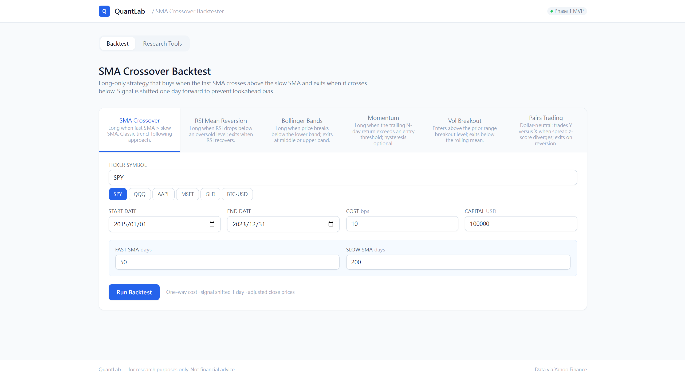
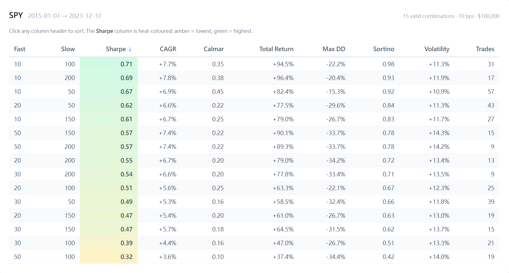
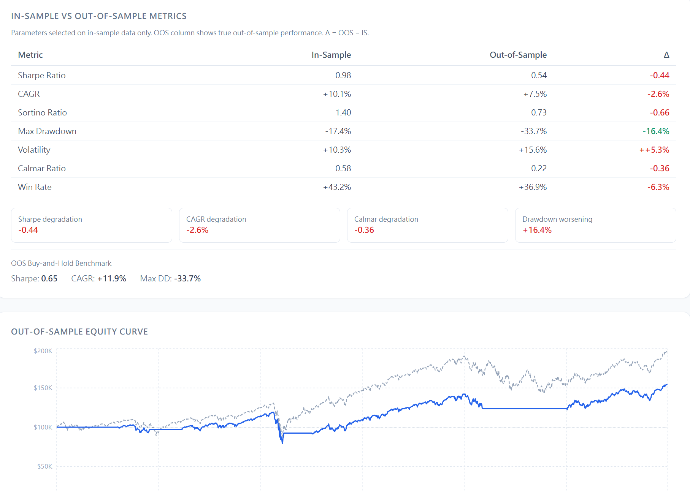
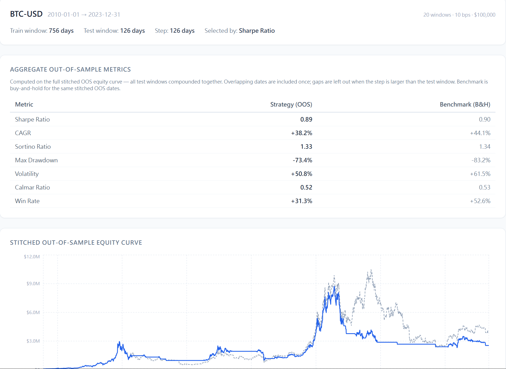
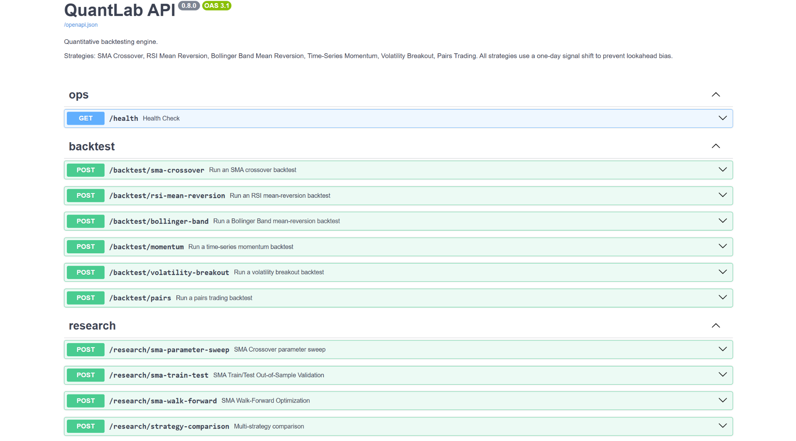

# QuantLab

An interactive quantitative research and backtesting platform built for learning, exploration, and portfolio demonstration.

QuantLab lets you select a strategy, choose an asset and date range, tune parameters, and instantly see equity curves, drawdown charts, performance metrics, and trade logs — all computed on real historical price data with no lookahead bias.

---

## Tech Stack

| Layer | Technology |
|---|---|
| Backend API | FastAPI · Python 3.11 · Pydantic v2 |
| Data | yfinance (OHLCV daily) |
| Backtest engine | NumPy · pandas (vectorised) |
| Frontend | Next.js 14 · React 18 · TypeScript |
| Styling | Tailwind CSS |
| Charts | Recharts |
| Local persistence | SQLite for saved backtests |
| Testing | pytest (325+ tests, synthetic data) |
| CI | GitHub Actions |
| Containerisation | Docker · Docker Compose |

---

## Features

### Strategies

| Strategy | Type | Parameters |
|---|---|---|
| SMA Crossover | Trend-following | Fast window, slow window |
| RSI Mean Reversion | Mean-reversion | RSI window, oversold threshold, exit threshold |
| Bollinger Band Mean Reversion | Mean-reversion | Window, std multiplier, exit band |
| Time-Series Momentum | Trend-following | Momentum window, entry/exit thresholds |
| Volatility Breakout | Trend-following | Lookback window, breakout multiplier, exit window |
| Pairs Trading | Statistical arbitrage | Asset Y, asset X, lookback window, entry/exit z-score |

All strategies apply a **one-day signal shift** — the position derived from day T's close prices is applied on day T+1. This prevents lookahead bias by construction.

### Research Tools

| Tool | Purpose |
|---|---|
| SMA Parameter Sweep | Grid search over fast/slow window combinations; ranks by Sharpe, CAGR, or Calmar |
| SMA Train/Test Validation | Splits data at a user-defined date; selects parameters in-sample, evaluates out-of-sample; reports degradation and an `oos_collapsed` flag |
| SMA Walk-Forward Optimization | Rolls a training window forward, re-selects parameters each fold, stitches OOS windows into a continuous equity curve |
| Strategy Comparison | Runs all five single-asset strategies on the same ticker/period with default parameters and ranks them |

### Performance Metrics

Total return · CAGR · Sharpe ratio · Sortino ratio · Calmar ratio · Max drawdown · Annualised volatility · Win rate · Trade count

Benchmark: buy-and-hold with no transaction costs.

### CSV Upload Backtesting

The **CSV Backtest** workspace lets you upload your own historical price CSV and run any single-asset strategy on it (Pairs Trading excluded). Column detection is flexible: a date column (`date` / `datetime` / `timestamp`) and a close column (`close` / `adj_close` / `adjusted_close`) are required; optional OHLCV columns are ignored. The uploaded series flows through the same lookahead-bias-free strategy, backtest, and metrics stack as the yfinance endpoints (`POST /backtest/csv`).

### Saved Backtests

Completed backtest results can be saved to a local SQLite database and reopened from the Saved Backtests view. Saved records preserve the run name, notes, strategy parameters, metrics, equity curve, and trade log.

The local database lives at `backend/data/quantlab.db`. The backend creates `backend/data/` automatically when needed, and `backend/data/*.db` is ignored by git so local research artifacts are not committed.

### Engineering

- Vectorised backtest engine (no Python loops over price series)
- Transaction cost model: flat bps charged on each position change
- Pydantic v2 request/response schemas with full validation
- 325+ pytest tests using synthetic data (no network calls)
- GitHub Actions CI: backend tests + frontend build on every push/PR
- Docker Compose: one command to start the full stack

---

## Screenshots

### Main Backtest Dashboard



### Strategy Comparison


### SMA Parameter Sweep



### Train/Test Validation



### Walk-Forward Optimization



### FastAPI Docs



---

## Architecture

```
Browser
  │
  │  http://localhost:3000
  ▼
Next.js Frontend  (React 18, Tailwind, Recharts)
  │  BacktestForm → SmaSweepPanel → StrategyComparisonPanel → …
  │
  │  /api/*  (proxied at build time via next.config.js rewrites)
  ▼
FastAPI Backend  (Python 3.11, Pydantic v2)
  │  /backtest/*  /research/*  /saved-backtests  /health
  │
  ├── data.py        yfinance OHLCV download + alignment
  ├── strategies.py  Signal generation (all shift-by-1)
  ├── backtest.py    Vectorised engine, trade log, benchmark
  ├── metrics.py     Sharpe, CAGR, drawdown, Sortino, Calmar, …
  ├── db.py          SQLite connection + schema initialisation
  ├── saved_backtests.py  Saved-backtest CRUD helpers
  └── schemas.py     Pydantic request / response models
```

In Docker, the browser never calls the backend directly:

```
Browser  →  localhost:3000/api/*
                │
          Next.js server (frontend container)
                │  rewrites /api/* → http://backend:8000/*
                ▼
          FastAPI server (backend container, internal DNS)
```

---

## Quick Start — Docker (recommended)

Requires Docker Desktop (or Docker Engine + Compose V2).

```bash
docker compose up --build
```

| Service | URL |
|---|---|
| Frontend dashboard | http://localhost:3000 |
| Backend API | http://localhost:8000 |
| Interactive API docs | http://localhost:8000/docs |

The first build pulls base images and installs all dependencies. Subsequent starts reuse cached layers.

**Stop:**

```bash
# Ctrl+C, then:
docker compose down
```

---

## Quick Start — Local Development

### Prerequisites

- Python 3.11+
- Node.js 20+

### Backend

```powershell
# create and activate a virtual environment (Windows PowerShell)
python -m venv .venv
.venv\Scripts\Activate.ps1

# install dependencies
pip install -r backend\requirements.txt

# start the API server
cd backend
python -m uvicorn app.main:app --reload --port 8000
```

Backend: http://localhost:8000  
Swagger docs: http://localhost:8000/docs

Saved backtests are persisted locally in `backend/data/quantlab.db`. Delete that file to reset local saved runs.

### Frontend

Open a second terminal:

```powershell
cd frontend
npm install        # first time only
npm run dev
```

Frontend: http://localhost:3000

---

## Testing

```powershell
cd backend
python -m pytest -q
```

All 325+ tests use synthetic price data — no network calls, no yfinance dependency at test time.

---

## CI

GitHub Actions runs on every push and pull request to `main`:

| Job | What it does |
|---|---|
| `backend-tests` | Installs Python 3.11 deps, runs `pytest -q` |
| `frontend-build` | Installs Node 20 deps via `npm ci`, runs `next build` |

See [`.github/workflows/ci.yml`](.github/workflows/ci.yml).

---

## Project Layout

```
quantlab/
├── backend/
│   ├── app/
│   │   ├── main.py          FastAPI routes (backtest + research endpoints)
│   │   ├── strategies.py    Signal generation — all shift by 1 day
│   │   ├── backtest.py      Vectorised backtest engine + trade log
│   │   ├── metrics.py       Sharpe, CAGR, drawdown, Sortino, Calmar, …
│   │   ├── schemas.py       Pydantic v2 request / response models
│   │   ├── data.py          yfinance OHLCV download layer
│   │   └── utils.py         Shared helpers (date validation, etc.)
│   ├── tests/               pytest suite (325+ tests, synthetic data)
│   ├── Dockerfile
│   ├── .dockerignore
│   └── requirements.txt
├── frontend/
│   ├── src/
│   │   ├── app/             Next.js App Router pages
│   │   ├── components/      React components (BacktestForm, charts, panels)
│   │   └── lib/             API client, TypeScript types, formatters
│   ├── Dockerfile
│   ├── .dockerignore
│   └── package.json
├── docs/
│   ├── PROJECT_OVERVIEW.md  Module descriptions and data flow
│   ├── ROADMAP.md           Completed phases and future plans
│   ├── LIMITATIONS.md       Known constraints and caveats
│   └── screenshots/         Screenshot placeholders
├── .github/
│   └── workflows/
│       └── ci.yml           GitHub Actions CI
├── docker-compose.yml
└── README.md
```

---

## Known Limitations

See [`docs/LIMITATIONS.md`](docs/LIMITATIONS.md) for the full list. Key points:

- Price data from yfinance may have gaps, splits, or quality issues
- No survivorship-bias-free database
- No intraday data or live trading
- Annualisation assumes 252 trading days (equities convention)
- Parameter sweeps can overfit in-sample — always check out-of-sample results

---

## Roadmap

See [`docs/ROADMAP.md`](docs/ROADMAP.md) for the full phase plan. Completed phases:

- Phase 0 — project setup and structure
- Phase 1 — backend MVP (backtest engine + metrics)
- Phase 2 — frontend dashboard
- Phase 3 — strategy expansion (RSI, Bollinger, Momentum, VB, Pairs)
- Phase 4 — research tools (sweep, train/test, walk-forward, comparison)
- Phase 5 — engineering infrastructure (CI, Docker, numeric input UX)

---

## Educational Disclaimer

QuantLab is a learning and research tool. **Nothing on this platform constitutes investment advice.** Strategy backtests reflect historical simulated performance only. Past performance is not indicative of future results. Real trading involves costs, market impact, execution risk, and other factors not modelled here.

---

## Troubleshooting

### Port already in use

```powershell
# Windows — free port 3000
Stop-Process -Id (Get-NetTCPConnection -LocalPort 3000).OwningProcess -Force

# macOS / Linux
lsof -ti:3000 | xargs kill
```

Substitute `8000` for the backend port.

### Frontend shows "Backend request failed"

1. Confirm both containers are running: `docker compose ps`
2. Check backend health: `curl http://localhost:8000/health`
3. Check logs: `docker compose logs backend`
4. After editing source code, rebuild: `docker compose up --build`

### Changes not reflected after editing source

The Docker image is built once. After editing source code:

```bash
docker compose up --build
```

For faster iteration, use the local dev workflow (`npm run dev` + `uvicorn --reload`).
