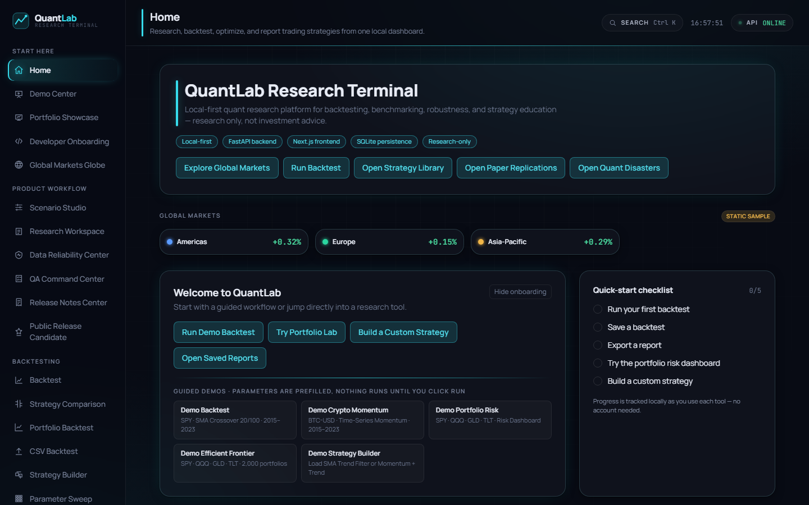
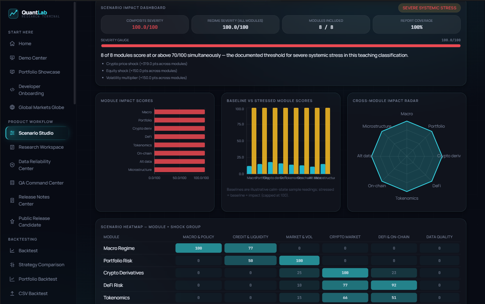
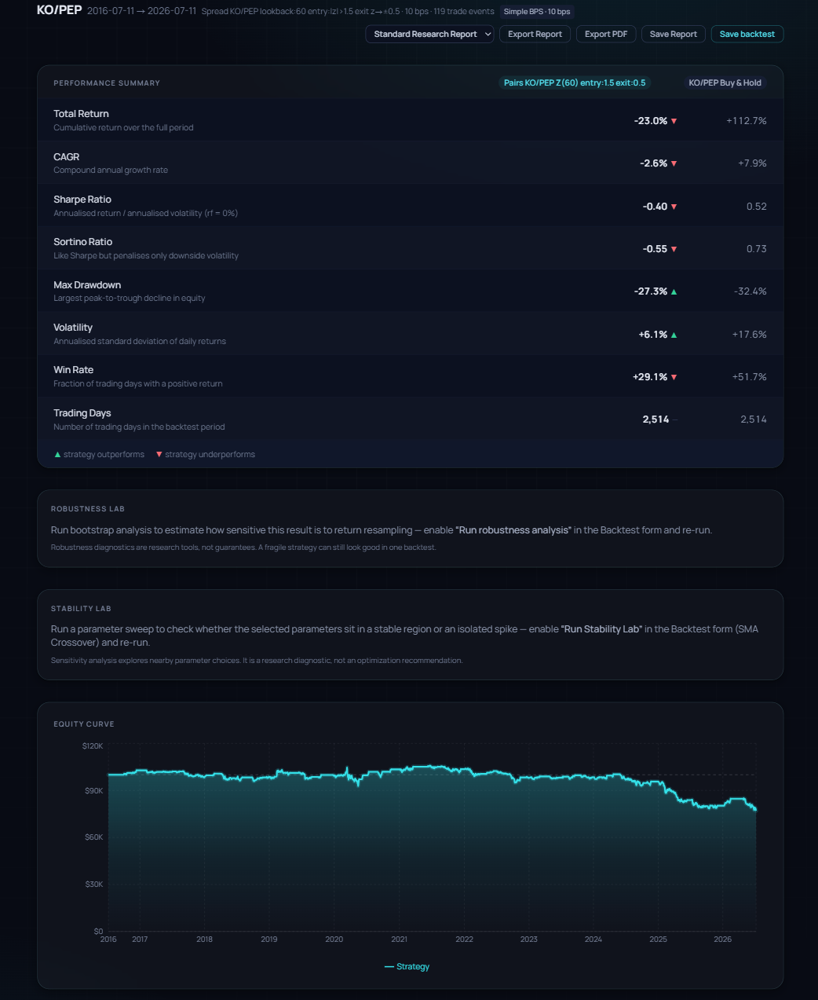

# QuantLab — Interactive Quant Research Platform

A deterministic, local-first, **educational** quant research platform:
interactive labs for portfolio risk, macro regimes, derivatives, crypto/DeFi
risk, market microstructure, scenario analysis, research journaling, data
reliability, and QA readiness — behind one shell (sidebar, dashboard, command
palette, shared charts, local LaTeX formula panels).

> **Ground rules:** deterministic static sample / synthetic / user-entered
> data (optional external providers are disabled by default and fail closed);
> no live trading, no telemetry, no login, no cloud. Educational only — not
> investment, trading, allocation, legal, tax, compliance, or risk-management
> advice, and not production trading, risk, or compliance infrastructure.

## Screenshots

Frozen v4.60 release evidence — captured from the production build on
deterministic sample data (hashes recorded in
[docs/DEMO_FREEZE_CHECKLIST.md](docs/DEMO_FREEZE_CHECKLIST.md)):







More captures: [docs/screenshots/](docs/screenshots/README.md).

## What this project demonstrates

- **Full-stack engineering** — FastAPI + Pydantic v2 backend, Next.js 14 +
  TypeScript + Tailwind frontend, typed end to end.
- **Quantitative finance modeling** — documented educational implementations
  across ~40 workspaces (options, volatility, rates, credit, FX, futures,
  real estate/MBS, microstructure, crypto derivatives/DeFi/tokenomics/
  on-chain, alternative data, macro regimes).
- **Deterministic sample-data design** — every lab runs offline on
  hand-written static samples; tests never depend on live providers.
- **API design** — consistent `GET /sample` + `POST /analyze` pattern with
  strict validation (`extra="forbid"`, finite-float guards, friendly 422s).
- **Frontend data visualization** — shared theme-aware recharts components,
  interactive shock sliders, local KaTeX formula rendering (no CDNs).
- **Risk-aware product language** — every module states its data mode,
  simplifications, and limitations in the UI and docs.
- **Testing & QA workflow** — a large deterministic backend test suite
  (2,975 green as of Phase 45.0), CI preflight (backend tests + frontend
  typecheck/build), a 12-test Playwright browser guard for the frozen demo
  path with a manually triggered CI workflow, a QA Command Center, and a
  Data Reliability Center.
- **Documentation discipline** — per-phase roadmap entries, limitations
  ledger, demo scripts, and this launch pack.

## Major modules

- **Start Here / Product Workflow** — Home dashboard, Demo Center (guided
  walkthroughs + module health), Portfolio Showcase, Scenario Studio
  (cross-lab stress + report builder), Research Workspace (presets +
  experiment journal), Data Reliability Center, QA Command Center.
- **Portfolio & Macro** — Portfolio Risk Lab, Macro Regime & Cross-Asset
  Allocation Lab, portfolio backtest/optimization/frontier/stress/factor
  tools.
- **Derivatives** — Options Lab (BS/greeks/trees/Monte Carlo/Heston),
  Volatility Surface & Variance Swap Lab, Futures & Commodities Lab.
- **Crypto & DeFi** — Crypto Derivatives (funding/basis), DeFi Risk
  (peg/lending/health factor), Tokenomics (unlocks/treasury), On-Chain
  Analytics (flows/whales).
- **Market Structure** — Market Microstructure & Execution Lab (order book,
  TCA, order-flow toxicity), Alternative Data & Signal Decay Lab, Event Lab.
- **Real Assets & Credit** — Real Estate & MBS Prepayment Lab, Credit Risk
  Lab, Yield Curve & Short Rate Labs, FX Lab.
- **Methodology & QA** — Backtest Studio + Strategy Comparison (lookahead-safe,
  cost-aware), Cross-Sectional Scanner, AFML Methodology Lab (triple-barrier,
  purged CV, sequential bootstrap, fracdiff), Strategy Library / Paper
  Replications / Quant Disasters.

## Quick start (user-run commands)

New here? [`docs/LOCAL_DEMO_GUIDE.md`](docs/LOCAL_DEMO_GUIDE.md) and
[`docs/DEVELOPER_ONBOARDING.md`](docs/DEVELOPER_ONBOARDING.md) are the guided
versions of this section; `scripts\check_environment.ps1` is a **read-only**
environment doctor, and [`docs/TROUBLESHOOTING.md`](docs/TROUBLESHOOTING.md)
covers the common failures. Safe local helper scripts (inspect before
running; they never install, build, download, or touch secrets) live in
`scripts\*.ps1` — see [`docs/COMMAND_REFERENCE.md`](docs/COMMAND_REFERENCE.md).

Backend (Python venv lives at `backend\venv`):

```powershell
cd C:\quantlab\backend
venv\Scripts\uvicorn app.main:app --reload --port 8000
```

Frontend:

```powershell
cd C:\quantlab\frontend
npm install
npm run dev
```

Production build (run locally by you — not by any tooling in this repo):

```powershell
cd C:\quantlab\frontend
npm run build
```

Docker Compose (`docker compose up --build`) brings up both services; CI
(`.github/workflows/ci.yml`) runs backend tests and a frontend build on push.

## Testing

```powershell
cd C:\quantlab
backend\venv\Scripts\python.exe -m pytest backend\tests -q

cd C:\quantlab\frontend
npx tsc --noEmit
npm run e2e   # browser regression guard for the frozen demo path
              # (local/manual; servers must already be running —
              #  see docs/BROWSER_E2E_RUNBOOK.md)
              # The same suite can be run in an isolated CI runner via the
              # manually triggered "Browser E2E Preflight" workflow
              # (docs/CI_BROWSER_E2E.md) — not part of the push/PR gate.
```

## Suggested demo path

1. **Demo Center** — pick a guided walkthrough, check module health.
2. **Scenario Studio** — flip Soft Landing → Severe Combo, copy the report.
3. **Research Workspace** — stage runs in a preset, export Markdown/JSON.
4. **Data Reliability Center** — data modes, offline fixtures, provider caveats.
5. **QA Command Center** — smoke matrix, release readiness, command checklist.

See `docs/DEMO_SCRIPT.md`, `docs/DEMO_VIDEO_SCRIPT.md`, and
`docs/PORTFOLIO_LAUNCH_PACK.md` for presenting the project.

## Data & safety

- Deterministic static sample data in most labs; the backtest engines use
  user-configured inputs, and the built-in KO/PEP pairs demo has a
  network-free deterministic fixture.
- Optional external providers (yfinance historical downloads, opt-in FRED
  macro, opt-in delayed quotes for the globe) are **disabled by default,
  fail closed to static data, and are never relied on in tests**; their
  availability is never guaranteed.
- **Not investment advice. Not a trading system. Not production risk,
  compliance, or data-governance infrastructure.** Educational and portfolio
  purposes only. See `docs/LIMITATIONS.md` for the full honest ledger.

---

## Current research focus (Phase 1: futures-first)

QuantLab is also being upgraded in-place as a long-term multi-market platform,
futures-first, while preserving the existing code.

**QuantLab local futures data path v0.1 is stable.** The local, synthetic-only
futures data foundation is complete end to end:

- Instruments supported: **ES, NQ, YM, RTY** (validated, immutable YAML specs).
- Per-record futures daily bar schema with registry-aware validation.
- A read-only local CSV workflow, synthetic data only, no network:

  ```
  local CSV -> validate -> normalize -> processed CSV -> metadata lookup -> tiny futures report
  ```

- Read-only smoke checks and reports all exit 0; full backend suite green
  (2,900 passed as of Phase 38.0).

Key files for the local futures data path:

- `backend/app/instruments/` — spec, futures contract, and registry code
- `configs/instruments/` — `es.yaml`, `nq.yaml`, `ym.yaml`, `rty.yaml`
- `backend/app/datastore/daily_bar.py` — per-record futures daily bar schema
- `backend/app/datastore/csv_fixtures.py` — local CSV loader (`load_futures_bars_csv`)
- `scripts/check_instruments.py`, `scripts/check_futures_metadata.py` — registry / metadata smoke checks
- `scripts/check_local_futures_csv.py` — validate local CSVs, read-only
- `scripts/normalize_local_futures_csv.py` — validate + write one normalized CSV per root
- `scripts/report_local_futures_csv.py` — per-root summary of normalized CSV output
- `scripts/run_synthetic_futures_report.py` — synthetic mini trade report
- `docs/INSTRUMENTS_LAYER.md` — instruments layer architecture note
- `docs/FUTURES_DATA_INGESTION_PLAN.md` — how real futures data will enter later (design only)

### Not allowed yet (deliberate scope limits)

- ML beyond the methodology labs
- CFDs
- options work in the futures pipeline (the educational Options Lab predates this scope)
- futures_continuous beyond the local pipeline
- real data download for the futures path (no IBKR)
- production trading
- major backtest engine rewrite

### Verification (futures path)

```powershell
backend\venv\Scripts\python.exe scripts\check_instruments.py
backend\venv\Scripts\python.exe scripts\check_futures_metadata.py
backend\venv\Scripts\python.exe scripts\run_synthetic_futures_report.py
backend\venv\Scripts\python.exe scripts\check_local_futures_csv.py --path backend\tests\fixtures
backend\venv\Scripts\python.exe scripts\normalize_local_futures_csv.py --input backend\tests\fixtures --output-dir backend\tests\_tmp_normalized_futures
backend\venv\Scripts\python.exe scripts\report_local_futures_csv.py --input backend\tests\_tmp_normalized_futures
backend\venv\Scripts\python.exe -m pytest backend/tests -q
```

The two CSV commands write only to `backend\tests\_tmp_normalized_futures`, a
throwaway folder that is not committed; delete it afterward
(`Remove-Item -Recurse -Force backend\tests\_tmp_normalized_futures`).

## Research CLI quickstart

Run the synthetic ES ML experiment demo from Windows PowerShell. **This is a
synthetic ES demo, not real market performance.** It runs the full Phase 1→6
pipeline — raw synthetic futures → continuous futures → features → labels → ML
evaluation → experiment registry — and prints `train_run_hash`, metrics,
`artifact_dir`, and a reproduce command.

```powershell
cd C:\quantlab\backend

.\venv\Scripts\python.exe -m app.research_cli.cli run --artifacts-dir ..\artifacts\experiments --overwrite
.\venv\Scripts\python.exe -m app.research_cli.cli list --artifacts-dir ..\artifacts\experiments
.\venv\Scripts\python.exe -m app.research_cli.cli best --artifacts-dir ..\artifacts\experiments --metric sharpe
```

The `run` and `list` subcommands have equivalent direct wrapper scripts:

```powershell
.\venv\Scripts\python.exe .\scripts\run_es_ml_experiment.py --artifacts-dir ..\artifacts\experiments --overwrite
.\venv\Scripts\python.exe .\scripts\list_experiments.py --artifacts-dir ..\artifacts\experiments
```

Artifacts are written under `artifacts/experiments/` and are gitignored. To
compare runs, pass real `train_run_hash` values taken from the `list` output:

```powershell
.\venv\Scripts\python.exe -m app.research_cli.cli compare <train_run_hash_a> <train_run_hash_b> --artifacts-dir ..\artifacts\experiments
```

## Platform layer notes

The Next.js frontend (`frontend/`) ships the educational research labs on
deterministic static sample data (see `docs/PROJECT_OVERVIEW.md` and
`docs/LIMITATIONS.md`). Highlights from recent phases:

- **Interactive lab controls & charts (31.5)** — deterministic shock sliders,
  horizon selectors, and local recharts panels across the crypto/alt-data
  labs; every control is a client-side transform of the static sample.
- **Scenario Studio (32.0)** — ten scenario templates mapped through
  documented impact-score weight tables into module charts, a heatmap, a
  regime read, and a copyable Markdown report.
- **Research Workspace (33.0)** — saved research packs, an experiment journal
  with severity/coverage/reproducibility scores, Markdown/JSON exports, and
  optional browser-local drafts (localStorage only).
- **Demo Center (34.0)** — eight guided demo paths with deep links, a
  21-module health dashboard, a capability matrix, and an audience-aware demo
  script builder.
- **Data Reliability Center (35.0)** — data-mode/provider/fixture registries,
  documented reliability rates and score; tests never depend on live
  providers and default demos have deterministic fallbacks.
- **QA Command Center (36.0)** — release-readiness rates and score, a
  smoke-test matrix, regression checklists, the exact local verification
  commands, and copy-friendly release notes. **It does not prove tests were
  run** — verification stays a local step.
- **Platform UX polish (37.0)** — app-router error/loading/not-found safety
  pages, an 11-group sidebar, dashboard starting paths, accessible chart
  labels, and visible keyboard focus on shared sliders.
- **Portfolio launch pack (38.0)** — this README, the in-app Portfolio
  Showcase page, and the presentation docs under `docs/` (launch pack,
  screenshot checklist, demo video script, LinkedIn drafts, interview
  talking points, deployment readiness, public project summary).

## Project docs

- [docs/PROJECT_OVERVIEW.md](docs/PROJECT_OVERVIEW.md) — architecture map
- [docs/ROADMAP.md](docs/ROADMAP.md) — per-phase build log and future plans
- [CHANGELOG.md](CHANGELOG.md) · [VERSION](VERSION) — grouped changelog and the current milestone label
- [docs/VERSION_MANIFEST.md](docs/VERSION_MANIFEST.md) · [docs/RELEASE_CHECKLIST.md](docs/RELEASE_CHECKLIST.md) — versioning conventions and the release flow
- [docs/PROJECT_SNAPSHOT.md](docs/PROJECT_SNAPSHOT.md) · [docs/MILESTONE_HISTORY.md](docs/MILESTONE_HISTORY.md) — one-page handoff and the capability narrative
- [CONTRIBUTING.md](CONTRIBUTING.md) · [docs/CI.md](docs/CI.md) · [docs/CI_BROWSER_E2E.md](docs/CI_BROWSER_E2E.md) — how to contribute, what CI checks (and deliberately doesn't), and the manual browser-E2E preflight workflow
- [docs/REPOSITORY_HYGIENE.md](docs/REPOSITORY_HYGIENE.md) · [docs/SECURITY_AND_SECRETS.md](docs/SECURITY_AND_SECRETS.md) — what never gets committed, and the zero-secrets policy
- [docs/LIMITATIONS.md](docs/LIMITATIONS.md) — the honest limitations ledger
- [docs/PUBLIC_RELEASE_CANDIDATE.md](docs/PUBLIC_RELEASE_CANDIDATE.md) · [docs/PUBLIC_LAUNCH_READINESS.md](docs/PUBLIC_LAUNCH_READINESS.md) — the final manual verification pass and the go/no-go decision table (public portfolio readiness only)
- [docs/FINAL_SMOKE_TEST_RUNBOOK.md](docs/FINAL_SMOKE_TEST_RUNBOOK.md) · [docs/DEMO_FREEZE_CHECKLIST.md](docs/DEMO_FREEZE_CHECKLIST.md) — the page-by-page manual smoke pass and the demo freeze discipline
- [docs/KNOWN_LIMITATIONS_PUBLIC.md](docs/KNOWN_LIMITATIONS_PUBLIC.md) · [docs/FINAL_DEMO_SCRIPT.md](docs/FINAL_DEMO_SCRIPT.md) — public-facing limitations and the timed final demo scripts
- [docs/BROWSER_E2E_RUNBOOK.md](docs/BROWSER_E2E_RUNBOOK.md) · [docs/FROZEN_DEMO_REGRESSION_GUARD.md](docs/FROZEN_DEMO_REGRESSION_GUARD.md) · [docs/PLAYWRIGHT_SETUP.md](docs/PLAYWRIGHT_SETUP.md) — the local browser E2E harness guarding the frozen demo path (regression signal, not certification)
- [docs/GITHUB_RELEASE_DRAFT_v4.61.md](docs/GITHUB_RELEASE_DRAFT_v4.61.md) · [docs/RELEASE_ASSET_MANIFEST.md](docs/RELEASE_ASSET_MANIFEST.md) — copy-ready release text (published manually, never automatically) and the release asset inventory
- [docs/LINKEDIN_LAUNCH_POST.md](docs/LINKEDIN_LAUNCH_POST.md) · [docs/PORTFOLIO_CASE_STUDY.md](docs/PORTFOLIO_CASE_STUDY.md) · [docs/PUBLIC_REPO_README_CHECKLIST.md](docs/PUBLIC_REPO_README_CHECKLIST.md) — launch copy and the pre-publish README checklist
- [docs/DEMO_VIDEO_SHOT_LIST.md](docs/DEMO_VIDEO_SHOT_LIST.md) · [docs/DEMO_VIDEO_90_SECOND_SCRIPT.md](docs/DEMO_VIDEO_90_SECOND_SCRIPT.md) · [docs/DEMO_VIDEO_3_MINUTE_SCRIPT.md](docs/DEMO_VIDEO_3_MINUTE_SCRIPT.md) — the demo-video asset kit on the frozen demo path
- [docs/PORTFOLIO_LAUNCH_PACK.md](docs/PORTFOLIO_LAUNCH_PACK.md) — pitches & launch checklist
- [docs/PUBLIC_PROJECT_SUMMARY.md](docs/PUBLIC_PROJECT_SUMMARY.md) — recruiter / quant / technical summaries
- [docs/DEMO_SCRIPT.md](docs/DEMO_SCRIPT.md) · [docs/DEMO_VIDEO_SCRIPT.md](docs/DEMO_VIDEO_SCRIPT.md) — live & recorded demo scripts
- [docs/SCREENSHOT_CHECKLIST.md](docs/SCREENSHOT_CHECKLIST.md) · [docs/SCREENSHOT_PLAN.md](docs/SCREENSHOT_PLAN.md) — capture guides
- [docs/DEPLOYMENT_READINESS.md](docs/DEPLOYMENT_READINESS.md) — what hosted deployment would still need
- [docs/LOCAL_DEMO_GUIDE.md](docs/LOCAL_DEMO_GUIDE.md) · [docs/DEVELOPER_ONBOARDING.md](docs/DEVELOPER_ONBOARDING.md) — run it locally & contribute
- [docs/COMMAND_REFERENCE.md](docs/COMMAND_REFERENCE.md) · [docs/TROUBLESHOOTING.md](docs/TROUBLESHOOTING.md) · [docs/ENVIRONMENT_DOCTOR.md](docs/ENVIRONMENT_DOCTOR.md) — commands, fixes, and the read-only doctor script
- [TASKS.md](TASKS.md) — current task list
- [LOG.md](LOG.md) — work log
- [STOP_POINT.md](STOP_POINT.md) — latest checkpoint and next safe step

## Workflow

One tiny, tested commit at a time. Inspect first, change the smallest safe
thing, run the relevant tests, then record the result here and in LOG.md.
